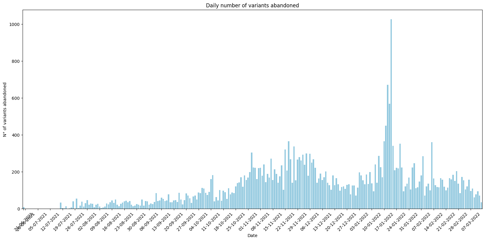
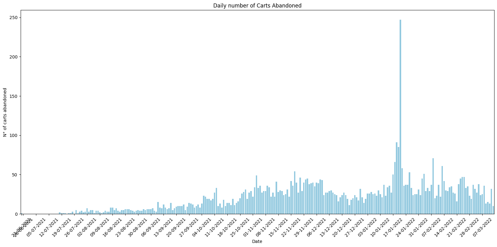
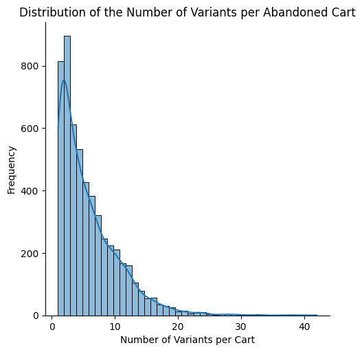
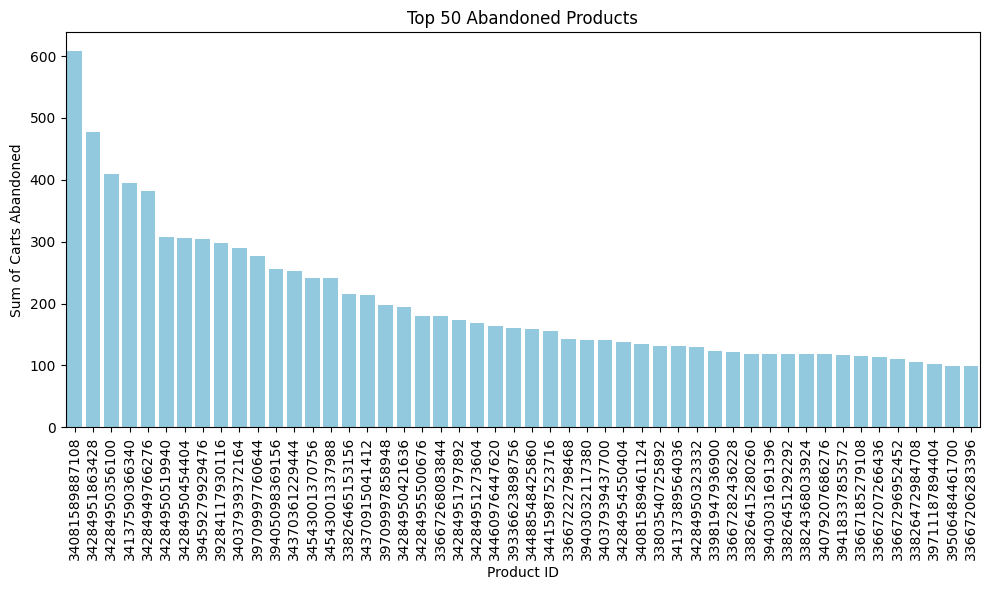
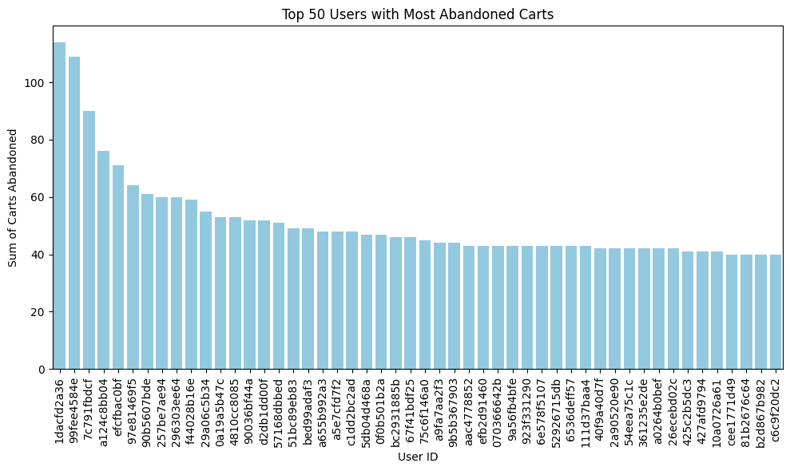
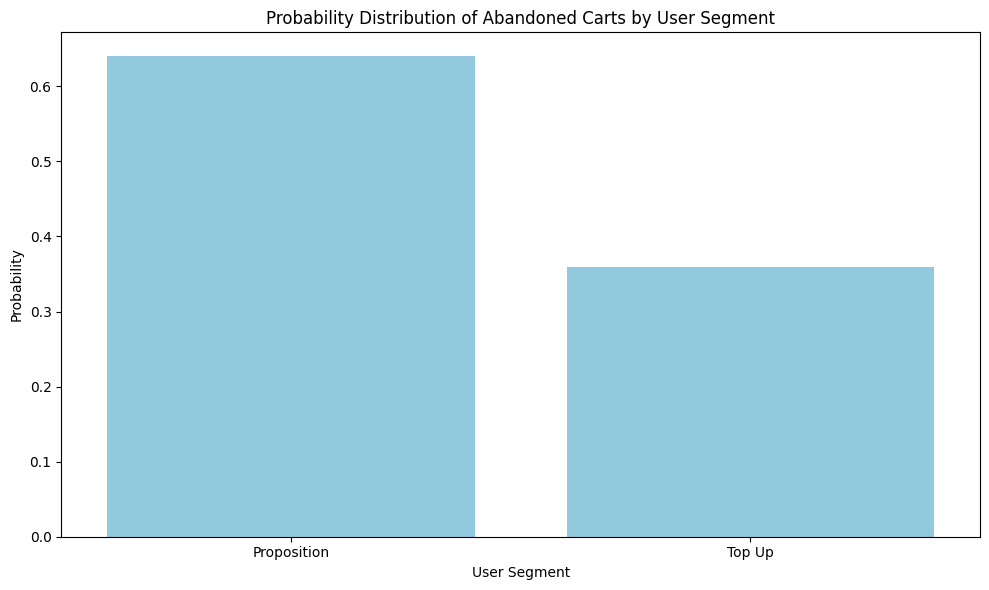

# 1. Understanding the problem space

First, I'm going to load all the datasets and take a quick look at their shapes and main characteristics.


```python
import pandas as pd
import numpy as np
import os
import matplotlib.pyplot as plt
import seaborn as sns
```


```python
!poetry add seaborn
```

    The following packages are already present in the pyproject.toml and will be skipped:
    
      - seaborn
    
    If you want to update it to the latest compatible version, you can use `poetry update package`.
    If you prefer to upgrade it to the latest available version, you can use `poetry add package@latest`.
    
    Nothing to add.


```python
data_dir = "/home/pedrotejero/zrive-ds/data/groceries/sampled-datasets"

dataframes = {}
for doc in os.listdir(data_dir):
    if doc.endswith(".parquet"):
        print(f"Processing {doc}...")
        file_name = os.path.splitext(doc)[0]
        dataframes[file_name] = pd.read_parquet(os.path.join(data_dir, doc))
    else:
        print(f"Skipping {doc}, not a parquet file.")
```

    Processing users.parquet...
    Processing orders.parquet...
    Processing abandoned_carts.parquet...
    Processing inventory.parquet...
    Processing regulars.parquet...


```python
print(f"Dataframes: {list(dataframes.keys())}")
```

    Dataframes: ['users', 'orders', 'abandoned_carts', 'inventory', 'regulars']


### Users


```python
users = dataframes["users"].copy()
users.head()
```


<div>
<style scoped>
    .dataframe tbody tr th:only-of-type {
        vertical-align: middle;
    }

    .dataframe tbody tr th {
        vertical-align: top;
    }

    .dataframe thead th {
        text-align: right;
    }
</style>
<table border="1" class="dataframe">
  <thead>
    <tr style="text-align: right;">
      <th></th>
      <th>user_id</th>
      <th>user_segment</th>
      <th>user_nuts1</th>
      <th>first_ordered_at</th>
      <th>customer_cohort_month</th>
      <th>count_people</th>
      <th>count_adults</th>
      <th>count_children</th>
      <th>count_babies</th>
      <th>count_pets</th>
    </tr>
  </thead>
  <tbody>
    <tr>
      <th>2160</th>
      <td>0e823a42e107461379e5b5613b7aa00537a72e1b0eaa7a...</td>
      <td>Top Up</td>
      <td>UKH</td>
      <td>2021-05-08 13:33:49</td>
      <td>2021-05-01 00:00:00</td>
      <td>NaN</td>
      <td>NaN</td>
      <td>NaN</td>
      <td>NaN</td>
      <td>NaN</td>
    </tr>
    <tr>
      <th>1123</th>
      <td>15768ced9bed648f745a7aa566a8895f7a73b9a47c1d4f...</td>
      <td>Top Up</td>
      <td>UKJ</td>
      <td>2021-11-17 16:30:20</td>
      <td>2021-11-01 00:00:00</td>
      <td>NaN</td>
      <td>NaN</td>
      <td>NaN</td>
      <td>NaN</td>
      <td>NaN</td>
    </tr>
    <tr>
      <th>1958</th>
      <td>33e0cb6eacea0775e34adbaa2c1dec16b9d6484e6b9324...</td>
      <td>Top Up</td>
      <td>UKD</td>
      <td>2022-03-09 23:12:25</td>
      <td>2022-03-01 00:00:00</td>
      <td>NaN</td>
      <td>NaN</td>
      <td>NaN</td>
      <td>NaN</td>
      <td>NaN</td>
    </tr>
    <tr>
      <th>675</th>
      <td>57ca7591dc79825df0cecc4836a58e6062454555c86c35...</td>
      <td>Top Up</td>
      <td>UKI</td>
      <td>2021-04-23 16:29:02</td>
      <td>2021-04-01 00:00:00</td>
      <td>NaN</td>
      <td>NaN</td>
      <td>NaN</td>
      <td>NaN</td>
      <td>NaN</td>
    </tr>
    <tr>
      <th>4694</th>
      <td>085d8e598139ce6fc9f75d9de97960fa9e1457b409ec00...</td>
      <td>Top Up</td>
      <td>UKJ</td>
      <td>2021-11-02 13:50:06</td>
      <td>2021-11-01 00:00:00</td>
      <td>NaN</td>
      <td>NaN</td>
      <td>NaN</td>
      <td>NaN</td>
      <td>NaN</td>
    </tr>
  </tbody>
</table>
</div>


```python
users.shape
```


    (4983, 10)


```python
users.info()
```

    <class 'pandas.core.frame.DataFrame'>
    Index: 4983 entries, 2160 to 3360
    Data columns (total 10 columns):
     #   Column                 Non-Null Count  Dtype  
    ---  ------                 --------------  -----  
     0   user_id                4983 non-null   object 
     1   user_segment           4983 non-null   object 
     2   user_nuts1             4932 non-null   object 
     3   first_ordered_at       4983 non-null   object 
     4   customer_cohort_month  4983 non-null   object 
     5   count_people           325 non-null    float64
     6   count_adults           325 non-null    float64
     7   count_children         325 non-null    float64
     8   count_babies           325 non-null    float64
     9   count_pets             325 non-null    float64
    dtypes: float64(5), object(5)
    memory usage: 428.2+ KB


It is important to note here that most of the values in the "count_" type columns are null. I would say that these variables aim to provide information about the family structure of the people who shop at the store.

### Orders


```python
orders = dataframes["orders"].copy()
orders.head(10)
```


<div>
<style scoped>
    .dataframe tbody tr th:only-of-type {
        vertical-align: middle;
    }

    .dataframe tbody tr th {
        vertical-align: top;
    }

    .dataframe thead th {
        text-align: right;
    }
</style>
<table border="1" class="dataframe">
  <thead>
    <tr style="text-align: right;">
      <th></th>
      <th>id</th>
      <th>user_id</th>
      <th>created_at</th>
      <th>order_date</th>
      <th>user_order_seq</th>
      <th>ordered_items</th>
    </tr>
  </thead>
  <tbody>
    <tr>
      <th>10</th>
      <td>2204073066628</td>
      <td>62e271062eb827e411bd73941178d29b022f5f2de9d37f...</td>
      <td>2020-04-30 14:32:19</td>
      <td>2020-04-30</td>
      <td>1</td>
      <td>[33618849693828, 33618860179588, 3361887404045...</td>
    </tr>
    <tr>
      <th>20</th>
      <td>2204707520644</td>
      <td>bf591c887c46d5d3513142b6a855dd7ffb9cc00697f6f5...</td>
      <td>2020-04-30 17:39:00</td>
      <td>2020-04-30</td>
      <td>1</td>
      <td>[33618835243140, 33618835964036, 3361886244058...</td>
    </tr>
    <tr>
      <th>21</th>
      <td>2204838822020</td>
      <td>329f08c66abb51f8c0b8a9526670da2d94c0c6eef06700...</td>
      <td>2020-04-30 18:12:30</td>
      <td>2020-04-30</td>
      <td>1</td>
      <td>[33618891145348, 33618893570180, 3361889766618...</td>
    </tr>
    <tr>
      <th>34</th>
      <td>2208967852164</td>
      <td>f6451fce7b1c58d0effbe37fcb4e67b718193562766470...</td>
      <td>2020-05-01 19:44:11</td>
      <td>2020-05-01</td>
      <td>1</td>
      <td>[33618830196868, 33618846580868, 3361891234624...</td>
    </tr>
    <tr>
      <th>49</th>
      <td>2215889436804</td>
      <td>68e872ff888303bff58ec56a3a986f77ddebdbe5c279e7...</td>
      <td>2020-05-03 21:56:14</td>
      <td>2020-05-03</td>
      <td>1</td>
      <td>[33667166699652, 33667166699652, 3366717122163...</td>
    </tr>
    <tr>
      <th>51</th>
      <td>2217346236548</td>
      <td>66a7b6a77952abc3ef3246da56fb148814704a3c2b420c...</td>
      <td>2020-05-04 11:25:26</td>
      <td>2020-05-04</td>
      <td>1</td>
      <td>[33667168796804, 33667178594436, 3366720605402...</td>
    </tr>
    <tr>
      <th>53</th>
      <td>2219446730884</td>
      <td>7ce6569d75a8bc75b72516e059edecb0bc2245750bfa68...</td>
      <td>2020-05-04 23:57:21</td>
      <td>2020-05-04</td>
      <td>1</td>
      <td>[33667178594436, 33667184492676, 3366721657254...</td>
    </tr>
    <tr>
      <th>61</th>
      <td>2222574076036</td>
      <td>f4f0753d9919c6d39afc6b1d797a34e31224698d5d92a5...</td>
      <td>2020-05-05 21:09:55</td>
      <td>2020-05-05</td>
      <td>1</td>
      <td>[33667168829572, 33667195437188, 3366721860416...</td>
    </tr>
    <tr>
      <th>68</th>
      <td>2224066986116</td>
      <td>aed88fc0b004270a62ff1fe4b94141f6b1db1496dbb0c0...</td>
      <td>2020-05-06 10:23:11</td>
      <td>2020-05-06</td>
      <td>1</td>
      <td>[33667171221636, 33667177382020, 3366717856166...</td>
    </tr>
    <tr>
      <th>70</th>
      <td>2224765862020</td>
      <td>4594e99557113d5a1c5b59bf31b8704aafe5c7bd180b32...</td>
      <td>2020-05-06 16:03:35</td>
      <td>2020-05-06</td>
      <td>1</td>
      <td>[33667174695044, 33667203596420, 3366720589018...</td>
    </tr>
  </tbody>
</table>
</div>


```python
orders.shape
```


    (8773, 6)


```python
orders.info()
```

    <class 'pandas.core.frame.DataFrame'>
    Index: 8773 entries, 10 to 64538
    Data columns (total 6 columns):
     #   Column          Non-Null Count  Dtype         
    ---  ------          --------------  -----         
     0   id              8773 non-null   int64         
     1   user_id         8773 non-null   object        
     2   created_at      8773 non-null   datetime64[ns]
     3   order_date      8773 non-null   datetime64[ns]
     4   user_order_seq  8773 non-null   int64         
     5   ordered_items   8773 non-null   object        
    dtypes: datetime64[ns](2), int64(2), object(2)
    memory usage: 479.8+ KB


```python
print(f"First order date: {orders['order_date'].min()}")
print(f"Last order date: {orders['order_date'].max()}")
```

    First order date: 2020-04-30 00:00:00
    Last order date: 2022-03-14 00:00:00


```python
orders.describe()
```


<div>
<style scoped>
    .dataframe tbody tr th:only-of-type {
        vertical-align: middle;
    }

    .dataframe tbody tr th {
        vertical-align: top;
    }

    .dataframe thead th {
        text-align: right;
    }
</style>
<table border="1" class="dataframe">
  <thead>
    <tr style="text-align: right;">
      <th></th>
      <th>id</th>
      <th>created_at</th>
      <th>order_date</th>
      <th>user_order_seq</th>
    </tr>
  </thead>
  <tbody>
    <tr>
      <th>count</th>
      <td>8.773000e+03</td>
      <td>8773</td>
      <td>8773</td>
      <td>8773.000000</td>
    </tr>
    <tr>
      <th>mean</th>
      <td>3.684684e+12</td>
      <td>2021-08-22 03:54:18.750028288</td>
      <td>2021-08-21 12:47:21.262966016</td>
      <td>2.445116</td>
    </tr>
    <tr>
      <th>min</th>
      <td>2.204073e+12</td>
      <td>2020-04-30 14:32:19</td>
      <td>2020-04-30 00:00:00</td>
      <td>1.000000</td>
    </tr>
    <tr>
      <th>25%</th>
      <td>3.690255e+12</td>
      <td>2021-04-25 11:50:37</td>
      <td>2021-04-25 00:00:00</td>
      <td>1.000000</td>
    </tr>
    <tr>
      <th>50%</th>
      <td>3.846692e+12</td>
      <td>2021-10-11 11:29:44</td>
      <td>2021-10-11 00:00:00</td>
      <td>1.000000</td>
    </tr>
    <tr>
      <th>75%</th>
      <td>3.945086e+12</td>
      <td>2022-01-03 18:14:23</td>
      <td>2022-01-03 00:00:00</td>
      <td>3.000000</td>
    </tr>
    <tr>
      <th>max</th>
      <td>4.026732e+12</td>
      <td>2022-03-14 00:24:59</td>
      <td>2022-03-14 00:00:00</td>
      <td>25.000000</td>
    </tr>
    <tr>
      <th>std</th>
      <td>4.145437e+11</td>
      <td>NaN</td>
      <td>NaN</td>
      <td>2.707693</td>
    </tr>
  </tbody>
</table>
</div>


"user_order_seq" is likely a cumulative count of the orders placed by each user.<br>
"ordered_items" is a list of the products included in each order.

### Inventory


```python
inventory = dataframes["inventory"].copy()
inventory
```


<div>
<style scoped>
    .dataframe tbody tr th:only-of-type {
        vertical-align: middle;
    }

    .dataframe tbody tr th {
        vertical-align: top;
    }

    .dataframe thead th {
        text-align: right;
    }
</style>
<table border="1" class="dataframe">
  <thead>
    <tr style="text-align: right;">
      <th></th>
      <th>variant_id</th>
      <th>price</th>
      <th>compare_at_price</th>
      <th>vendor</th>
      <th>product_type</th>
      <th>tags</th>
    </tr>
  </thead>
  <tbody>
    <tr>
      <th>0</th>
      <td>39587297165444</td>
      <td>3.09</td>
      <td>3.15</td>
      <td>heinz</td>
      <td>condiments-dressings</td>
      <td>[table-sauces, vegan]</td>
    </tr>
    <tr>
      <th>1</th>
      <td>34370361229444</td>
      <td>4.99</td>
      <td>5.50</td>
      <td>whogivesacrap</td>
      <td>toilet-roll-kitchen-roll-tissue</td>
      <td>[b-corp, eco, toilet-rolls]</td>
    </tr>
    <tr>
      <th>2</th>
      <td>34284951863428</td>
      <td>3.69</td>
      <td>3.99</td>
      <td>plenty</td>
      <td>toilet-roll-kitchen-roll-tissue</td>
      <td>[kitchen-roll]</td>
    </tr>
    <tr>
      <th>3</th>
      <td>33667283583108</td>
      <td>1.79</td>
      <td>1.99</td>
      <td>thecheekypanda</td>
      <td>toilet-roll-kitchen-roll-tissue</td>
      <td>[b-corp, cruelty-free, eco, tissue, vegan]</td>
    </tr>
    <tr>
      <th>4</th>
      <td>33803537973380</td>
      <td>1.99</td>
      <td>2.09</td>
      <td>colgate</td>
      <td>dental</td>
      <td>[dental-accessories]</td>
    </tr>
    <tr>
      <th>...</th>
      <td>...</td>
      <td>...</td>
      <td>...</td>
      <td>...</td>
      <td>...</td>
      <td>...</td>
    </tr>
    <tr>
      <th>1728</th>
      <td>39539419218052</td>
      <td>4.99</td>
      <td>5.99</td>
      <td>bother</td>
      <td></td>
      <td>[household-sundries]</td>
    </tr>
    <tr>
      <th>1729</th>
      <td>34534187368580</td>
      <td>4.69</td>
      <td>5.49</td>
      <td>tommeetippee</td>
      <td>baby-accessories</td>
      <td>[feeding-weaning]</td>
    </tr>
    <tr>
      <th>1730</th>
      <td>33826439594116</td>
      <td>15.39</td>
      <td>17.15</td>
      <td>colief</td>
      <td>baby-accessories</td>
      <td>[feeding-weaning]</td>
    </tr>
    <tr>
      <th>1731</th>
      <td>33667214508164</td>
      <td>19.49</td>
      <td>21.65</td>
      <td>enterosgel</td>
      <td>medicines-treatments</td>
      <td>[discontinue, first-aid]</td>
    </tr>
    <tr>
      <th>1732</th>
      <td>33667214704772</td>
      <td>31.99</td>
      <td>34.60</td>
      <td>eskimo3</td>
      <td>superfoods-supplements</td>
      <td>[discontinue, vitamins-supplements]</td>
    </tr>
  </tbody>
</table>
<p>1733 rows × 6 columns</p>
</div>


```python
inventory.info()
```

    <class 'pandas.core.frame.DataFrame'>
    RangeIndex: 1733 entries, 0 to 1732
    Data columns (total 6 columns):
     #   Column            Non-Null Count  Dtype  
    ---  ------            --------------  -----  
     0   variant_id        1733 non-null   int64  
     1   price             1733 non-null   float64
     2   compare_at_price  1733 non-null   float64
     3   vendor            1733 non-null   object 
     4   product_type      1733 non-null   object 
     5   tags              1733 non-null   object 
    dtypes: float64(2), int64(1), object(3)
    memory usage: 81.4+ KB


The Inventory table gives us some information about the products being sold. We don't have enough context to understand what the prices in the "compare_at_price" column refer to.

### Regulars


```python
regulars = dataframes["regulars"].copy()
regulars
```


<div>
<style scoped>
    .dataframe tbody tr th:only-of-type {
        vertical-align: middle;
    }

    .dataframe tbody tr th {
        vertical-align: top;
    }

    .dataframe thead th {
        text-align: right;
    }
</style>
<table border="1" class="dataframe">
  <thead>
    <tr style="text-align: right;">
      <th></th>
      <th>user_id</th>
      <th>variant_id</th>
      <th>created_at</th>
    </tr>
  </thead>
  <tbody>
    <tr>
      <th>3</th>
      <td>68e872ff888303bff58ec56a3a986f77ddebdbe5c279e7...</td>
      <td>33618848088196</td>
      <td>2020-04-30 15:07:03</td>
    </tr>
    <tr>
      <th>11</th>
      <td>aed88fc0b004270a62ff1fe4b94141f6b1db1496dbb0c0...</td>
      <td>33667178659972</td>
      <td>2020-05-05 23:34:35</td>
    </tr>
    <tr>
      <th>18</th>
      <td>68e872ff888303bff58ec56a3a986f77ddebdbe5c279e7...</td>
      <td>33619009208452</td>
      <td>2020-04-30 15:07:03</td>
    </tr>
    <tr>
      <th>46</th>
      <td>aed88fc0b004270a62ff1fe4b94141f6b1db1496dbb0c0...</td>
      <td>33667305373828</td>
      <td>2020-05-05 23:34:35</td>
    </tr>
    <tr>
      <th>47</th>
      <td>4594e99557113d5a1c5b59bf31b8704aafe5c7bd180b32...</td>
      <td>33667247341700</td>
      <td>2020-05-06 14:42:11</td>
    </tr>
    <tr>
      <th>...</th>
      <td>...</td>
      <td>...</td>
      <td>...</td>
    </tr>
    <tr>
      <th>37644</th>
      <td>20a41b8fa616484b39812aaa377ea1b53247f6941c0586...</td>
      <td>39265878999172</td>
      <td>2022-03-13 16:02:13</td>
    </tr>
    <tr>
      <th>37717</th>
      <td>ba068a3398230c10a98868ced1fcc5b889b21e6f112fd0...</td>
      <td>39459281272964</td>
      <td>2022-03-14 07:49:24</td>
    </tr>
    <tr>
      <th>37718</th>
      <td>ba068a3398230c10a98868ced1fcc5b889b21e6f112fd0...</td>
      <td>33973246951556</td>
      <td>2022-03-14 07:49:24</td>
    </tr>
    <tr>
      <th>37719</th>
      <td>ba068a3398230c10a98868ced1fcc5b889b21e6f112fd0...</td>
      <td>39587297656964</td>
      <td>2022-03-14 07:49:24</td>
    </tr>
    <tr>
      <th>37720</th>
      <td>ba068a3398230c10a98868ced1fcc5b889b21e6f112fd0...</td>
      <td>34415987753092</td>
      <td>2022-03-14 07:49:24</td>
    </tr>
  </tbody>
</table>
<p>18105 rows × 3 columns</p>
</div>


```python
regulars.info()
```

    <class 'pandas.core.frame.DataFrame'>
    Index: 18105 entries, 3 to 37720
    Data columns (total 3 columns):
     #   Column      Non-Null Count  Dtype         
    ---  ------      --------------  -----         
     0   user_id     18105 non-null  object        
     1   variant_id  18105 non-null  int64         
     2   created_at  18105 non-null  datetime64[ns]
    dtypes: datetime64[ns](1), int64(1), object(1)
    memory usage: 565.8+ KB


```python
regulars['variant_id'].nunique()
```


    1843


There are 1,843 unique products in the "Regulars" table, but we only have information about 1,733 products in the Inventory.<br>

This might indicate that Inventory table represents the inventory at a specific point in time rather than the company's entire historical inventory. Therefore, there are products that have been sold whose characteristics we won’t be able to know during this analysis.


```python
regulars['user_id'].nunique()
```


    1448


```python
percentage = (regulars['user_id'].nunique() / users.shape[0]) * 100
print(f"Percentage of users who have purchased any regular product: {percentage:.2f}%")
```

    Percentage of users who have purchased any regular product: 29.06%


### Abandoned Carts


```python
abandoned = dataframes["abandoned_carts"].copy()
abandoned
```


<div>
<style scoped>
    .dataframe tbody tr th:only-of-type {
        vertical-align: middle;
    }

    .dataframe tbody tr th {
        vertical-align: top;
    }

    .dataframe thead th {
        text-align: right;
    }
</style>
<table border="1" class="dataframe">
  <thead>
    <tr style="text-align: right;">
      <th></th>
      <th>id</th>
      <th>user_id</th>
      <th>created_at</th>
      <th>variant_id</th>
    </tr>
  </thead>
  <tbody>
    <tr>
      <th>0</th>
      <td>12858560217220</td>
      <td>5c4e5953f13ddc3bc9659a3453356155e5efe4739d7a2b...</td>
      <td>2020-05-20 13:53:24</td>
      <td>[33826459287684, 33826457616516, 3366719212762...</td>
    </tr>
    <tr>
      <th>13</th>
      <td>20352449839236</td>
      <td>9d6187545c005d39e44d0456d87790db18611d7c7379bd...</td>
      <td>2021-06-27 05:24:13</td>
      <td>[34415988179076, 34037940158596, 3450282236326...</td>
    </tr>
    <tr>
      <th>45</th>
      <td>20478401413252</td>
      <td>e83fb0273d70c37a2968fee107113698fd4f389c442c0b...</td>
      <td>2021-07-18 08:23:49</td>
      <td>[34543001337988, 34037939372164, 3411360609088...</td>
    </tr>
    <tr>
      <th>50</th>
      <td>20481783103620</td>
      <td>10c42e10e530284b7c7c50f3a23a98726d5747b8128084...</td>
      <td>2021-07-18 21:29:36</td>
      <td>[33667268116612, 34037940224132, 3443605520397...</td>
    </tr>
    <tr>
      <th>52</th>
      <td>20485321687172</td>
      <td>d9989439524b3f6fc4f41686d043f315fb408b954d6153...</td>
      <td>2021-07-19 12:17:05</td>
      <td>[33667268083844, 34284950454404, 33973246886020]</td>
    </tr>
    <tr>
      <th>...</th>
      <td>...</td>
      <td>...</td>
      <td>...</td>
      <td>...</td>
    </tr>
    <tr>
      <th>70036</th>
      <td>22233840976004</td>
      <td>2e989bfdec87ef55ea464a529f323ff53dad2a2fc48655...</td>
      <td>2022-03-13 14:11:15</td>
      <td>[34284950192260, 39466620911748]</td>
    </tr>
    <tr>
      <th>70041</th>
      <td>22233843171460</td>
      <td>b2d867b982b14ca517f27c4ced727c8a25c01b96ebbd96...</td>
      <td>2022-03-13 14:11:36</td>
      <td>[39536607395972, 39506484461700]</td>
    </tr>
    <tr>
      <th>70043</th>
      <td>22233843531908</td>
      <td>220aafc0749f209b3f0f7cfe4134a5136815d48f0bbd9a...</td>
      <td>2022-03-13 14:11:41</td>
      <td>[39482337624196, 39544243650692]</td>
    </tr>
    <tr>
      <th>70049</th>
      <td>22233846218884</td>
      <td>a4da55d51052411e54f98e1b90b19843121866abeaea76...</td>
      <td>2022-03-13 14:12:09</td>
      <td>[34415989325956, 33667297017988, 3948233762419...</td>
    </tr>
    <tr>
      <th>70050</th>
      <td>22233846317188</td>
      <td>c0e740ecabe7bd19eaed35b5ea9be7bc80c15f32124712...</td>
      <td>2022-03-13 14:12:10</td>
      <td>[34284950519940, 39459281174660, 39482337558660]</td>
    </tr>
  </tbody>
</table>
<p>5457 rows × 4 columns</p>
</div>


```python
abandoned.info()
```

    <class 'pandas.core.frame.DataFrame'>
    Index: 5457 entries, 0 to 70050
    Data columns (total 4 columns):
     #   Column      Non-Null Count  Dtype         
    ---  ------      --------------  -----         
     0   id          5457 non-null   int64         
     1   user_id     5457 non-null   object        
     2   created_at  5457 non-null   datetime64[ns]
     3   variant_id  5457 non-null   object        
    dtypes: datetime64[ns](1), int64(1), object(2)
    memory usage: 213.2+ KB


Here we find a possible error in the definition of variables, as they have named "variant_id" the list of products that were in abandoned carts, which could cause confusion since "variant_id" in the rest of the tables refers to the ID of a specific product.

If we add the number of orders placed to the number of carts that have been abandoned, we can see that:


```python
total = orders.shape[0] + abandoned.shape[0]

percentage = (abandoned.shape[0] / total) * 100
print(f"Percentage of orders that were abandoned: {percentage:.2f}%")
```

    Percentage of orders that were abandoned: 38.35%


```python
percentage = (abandoned['user_id'].nunique() / users.shape[0]) * 100
print(f"Percentage of users who have abandoned at least one cart: {percentage:.2f}%")
```

    Percentage of users who have abandoned at least one cart: 69.01%


# In-Depth Analysis

I want to analyze abandoned_carts in detail — when they occurred, how many there were, and who abandoned them — Because I think it is especially important for the business to know what could be going wrong.

## 1 - Abandoned Carts Analysis


```python
abandoned['created_at'] = pd.to_datetime(abandoned['created_at']).dt.date
abandoned = abandoned.sort_values(by='created_at')
```


```python
abandoned
```


<div>
<style scoped>
    .dataframe tbody tr th:only-of-type {
        vertical-align: middle;
    }

    .dataframe tbody tr th {
        vertical-align: top;
    }

    .dataframe thead th {
        text-align: right;
    }
</style>
<table border="1" class="dataframe">
  <thead>
    <tr style="text-align: right;">
      <th></th>
      <th>id</th>
      <th>user_id</th>
      <th>created_at</th>
      <th>variant_id</th>
    </tr>
  </thead>
  <tbody>
    <tr>
      <th>0</th>
      <td>12858560217220</td>
      <td>5c4e5953f13ddc3bc9659a3453356155e5efe4739d7a2b...</td>
      <td>2020-05-20</td>
      <td>[33826459287684, 33826457616516, 3366719212762...</td>
    </tr>
    <tr>
      <th>13</th>
      <td>20352449839236</td>
      <td>9d6187545c005d39e44d0456d87790db18611d7c7379bd...</td>
      <td>2021-06-27</td>
      <td>[34415988179076, 34037940158596, 3450282236326...</td>
    </tr>
    <tr>
      <th>45</th>
      <td>20478401413252</td>
      <td>e83fb0273d70c37a2968fee107113698fd4f389c442c0b...</td>
      <td>2021-07-18</td>
      <td>[34543001337988, 34037939372164, 3411360609088...</td>
    </tr>
    <tr>
      <th>50</th>
      <td>20481783103620</td>
      <td>10c42e10e530284b7c7c50f3a23a98726d5747b8128084...</td>
      <td>2021-07-18</td>
      <td>[33667268116612, 34037940224132, 3443605520397...</td>
    </tr>
    <tr>
      <th>52</th>
      <td>20485321687172</td>
      <td>d9989439524b3f6fc4f41686d043f315fb408b954d6153...</td>
      <td>2021-07-19</td>
      <td>[33667268083844, 34284950454404, 33973246886020]</td>
    </tr>
    <tr>
      <th>...</th>
      <td>...</td>
      <td>...</td>
      <td>...</td>
      <td>...</td>
    </tr>
    <tr>
      <th>70018</th>
      <td>22233836716164</td>
      <td>f1ce3b770bb7cda55332c49881b124cfcd9e63c450bddb...</td>
      <td>2022-03-13</td>
      <td>[39587296772228, 39478260695172]</td>
    </tr>
    <tr>
      <th>69946</th>
      <td>22230544056452</td>
      <td>efb2d9146077359da34e194901d38c0ca9b77d472d7b46...</td>
      <td>2022-03-13</td>
      <td>[34284955336836, 34246817022084, 3428495186342...</td>
    </tr>
    <tr>
      <th>70049</th>
      <td>22233846218884</td>
      <td>a4da55d51052411e54f98e1b90b19843121866abeaea76...</td>
      <td>2022-03-13</td>
      <td>[34415989325956, 33667297017988, 3948233762419...</td>
    </tr>
    <tr>
      <th>70023</th>
      <td>22233837961348</td>
      <td>56f5a49f45f8ede73c1c29d88425be89260a69a7edd07e...</td>
      <td>2022-03-13</td>
      <td>[34543001370756, 39459279929476]</td>
    </tr>
    <tr>
      <th>70050</th>
      <td>22233846317188</td>
      <td>c0e740ecabe7bd19eaed35b5ea9be7bc80c15f32124712...</td>
      <td>2022-03-13</td>
      <td>[34284950519940, 39459281174660, 39482337558660]</td>
    </tr>
  </tbody>
</table>
<p>5457 rows × 4 columns</p>
</div>


The first abandoned cart was recorded in May 2020, but the next one doesn't appear until a year later. At first glance, we don't know whether no carts were abandoned during that time or if the data simply wasn't recorded.


```python
abandoned = abandoned.explode('variant_id')
```


```python
abandoned
```


<div>
<style scoped>
    .dataframe tbody tr th:only-of-type {
        vertical-align: middle;
    }

    .dataframe tbody tr th {
        vertical-align: top;
    }

    .dataframe thead th {
        text-align: right;
    }
</style>
<table border="1" class="dataframe">
  <thead>
    <tr style="text-align: right;">
      <th></th>
      <th>id</th>
      <th>user_id</th>
      <th>created_at</th>
      <th>variant_id</th>
    </tr>
  </thead>
  <tbody>
    <tr>
      <th>0</th>
      <td>12858560217220</td>
      <td>5c4e5953f13ddc3bc9659a3453356155e5efe4739d7a2b...</td>
      <td>2020-05-20</td>
      <td>33826459287684</td>
    </tr>
    <tr>
      <th>0</th>
      <td>12858560217220</td>
      <td>5c4e5953f13ddc3bc9659a3453356155e5efe4739d7a2b...</td>
      <td>2020-05-20</td>
      <td>33826457616516</td>
    </tr>
    <tr>
      <th>0</th>
      <td>12858560217220</td>
      <td>5c4e5953f13ddc3bc9659a3453356155e5efe4739d7a2b...</td>
      <td>2020-05-20</td>
      <td>33667192127620</td>
    </tr>
    <tr>
      <th>0</th>
      <td>12858560217220</td>
      <td>5c4e5953f13ddc3bc9659a3453356155e5efe4739d7a2b...</td>
      <td>2020-05-20</td>
      <td>33826412331140</td>
    </tr>
    <tr>
      <th>0</th>
      <td>12858560217220</td>
      <td>5c4e5953f13ddc3bc9659a3453356155e5efe4739d7a2b...</td>
      <td>2020-05-20</td>
      <td>33826472558724</td>
    </tr>
    <tr>
      <th>...</th>
      <td>...</td>
      <td>...</td>
      <td>...</td>
      <td>...</td>
    </tr>
    <tr>
      <th>70023</th>
      <td>22233837961348</td>
      <td>56f5a49f45f8ede73c1c29d88425be89260a69a7edd07e...</td>
      <td>2022-03-13</td>
      <td>34543001370756</td>
    </tr>
    <tr>
      <th>70023</th>
      <td>22233837961348</td>
      <td>56f5a49f45f8ede73c1c29d88425be89260a69a7edd07e...</td>
      <td>2022-03-13</td>
      <td>39459279929476</td>
    </tr>
    <tr>
      <th>70050</th>
      <td>22233846317188</td>
      <td>c0e740ecabe7bd19eaed35b5ea9be7bc80c15f32124712...</td>
      <td>2022-03-13</td>
      <td>34284950519940</td>
    </tr>
    <tr>
      <th>70050</th>
      <td>22233846317188</td>
      <td>c0e740ecabe7bd19eaed35b5ea9be7bc80c15f32124712...</td>
      <td>2022-03-13</td>
      <td>39459281174660</td>
    </tr>
    <tr>
      <th>70050</th>
      <td>22233846317188</td>
      <td>c0e740ecabe7bd19eaed35b5ea9be7bc80c15f32124712...</td>
      <td>2022-03-13</td>
      <td>39482337558660</td>
    </tr>
  </tbody>
</table>
<p>30869 rows × 4 columns</p>
</div>


### 1.1 - Number of products abandoned per day


```python
daily_abandoned = abandoned.groupby('created_at')['variant_id'].count().reset_index(name='n_variants_abandoned').sort_values(by='created_at')
daily_abandoned['created_at'] = pd.to_datetime(daily_abandoned['created_at'])
```


```python
daily_abandoned
```


<div>
<style scoped>
    .dataframe tbody tr th:only-of-type {
        vertical-align: middle;
    }

    .dataframe tbody tr th {
        vertical-align: top;
    }

    .dataframe thead th {
        text-align: right;
    }
</style>
<table border="1" class="dataframe">
  <thead>
    <tr style="text-align: right;">
      <th></th>
      <th>created_at</th>
      <th>n_variants_abandoned</th>
    </tr>
  </thead>
  <tbody>
    <tr>
      <th>0</th>
      <td>2020-05-20</td>
      <td>19</td>
    </tr>
    <tr>
      <th>1</th>
      <td>2021-06-27</td>
      <td>9</td>
    </tr>
    <tr>
      <th>2</th>
      <td>2021-07-18</td>
      <td>33</td>
    </tr>
    <tr>
      <th>3</th>
      <td>2021-07-19</td>
      <td>3</td>
    </tr>
    <tr>
      <th>4</th>
      <td>2021-07-20</td>
      <td>2</td>
    </tr>
    <tr>
      <th>...</th>
      <td>...</td>
      <td>...</td>
    </tr>
    <tr>
      <th>234</th>
      <td>2022-03-09</td>
      <td>62</td>
    </tr>
    <tr>
      <th>235</th>
      <td>2022-03-10</td>
      <td>77</td>
    </tr>
    <tr>
      <th>236</th>
      <td>2022-03-11</td>
      <td>94</td>
    </tr>
    <tr>
      <th>237</th>
      <td>2022-03-12</td>
      <td>72</td>
    </tr>
    <tr>
      <th>238</th>
      <td>2022-03-13</td>
      <td>35</td>
    </tr>
  </tbody>
</table>
<p>239 rows × 2 columns</p>
</div>


```python
daily_abandoned['n_variants_abandoned'].describe()
```


    count     239.000000
    mean      129.158996
    std       114.676673
    min         2.000000
    25%        44.500000
    50%       114.000000
    75%       174.000000
    max      1026.000000
    Name: n_variants_abandoned, dtype: float64


```python
print(f"{daily_abandoned['n_variants_abandoned'].mean():.2f} variants were abandoned daily on average.")
```

    129.16 variants were abandoned daily on average.


To better visualize the data in a plot, I’m going to omit the first row of the table, since, as I mentioned earlier, a year passes between the first and second records.

Also, I’m going to fill in the missing days in the dataset with 0s only for better data representation.


```python
df_plot = daily_abandoned.copy()
df_plot = df_plot[1:]
df_plot['created_at'] = pd.to_datetime(df_plot['created_at'])

full_range = pd.date_range(start=df_plot['created_at'].min(), end=df_plot['created_at'].max())
df_full = pd.DataFrame({'created_at': full_range})
df_merged = df_full.merge(df_plot, on='created_at', how='left')
df_merged['n_variants_abandoned'] = df_merged['n_variants_abandoned'].fillna(0).astype(int)
df_plot = df_merged.copy()

```


```python
plt.figure(figsize=(16, 8))
sns.barplot(data=df_plot, x='created_at', y='n_variants_abandoned', color='skyblue')

weekly_ticks = df_plot['created_at'].dt.to_period('W').drop_duplicates().dt.start_time
plt.xticks(
    ticks=[df_plot[df_plot['created_at'].dt.to_period('W') == week].index[0] for week in weekly_ticks.dt.to_period('W')],
    labels=weekly_ticks.dt.strftime('%d-%m-%Y'),
    rotation=45,
)

plt.xlabel('Date')
plt.ylabel('N° of variants abandoned')
plt.title('Daily number of variants abandoned')
plt.tight_layout()
plt.show()
```


    

    


### 1.2 - Number of carts abandoned per day


```python
n_carts_daily_abandoned = abandoned.groupby('created_at')['id'].nunique().reset_index(name='n_carts_abandoned').sort_values(by='created_at')
n_carts_daily_abandoned['created_at'] = pd.to_datetime(n_carts_daily_abandoned['created_at'])
n_carts_daily_abandoned
```


<div>
<style scoped>
    .dataframe tbody tr th:only-of-type {
        vertical-align: middle;
    }

    .dataframe tbody tr th {
        vertical-align: top;
    }

    .dataframe thead th {
        text-align: right;
    }
</style>
<table border="1" class="dataframe">
  <thead>
    <tr style="text-align: right;">
      <th></th>
      <th>created_at</th>
      <th>n_carts_abandoned</th>
    </tr>
  </thead>
  <tbody>
    <tr>
      <th>0</th>
      <td>2020-05-20</td>
      <td>1</td>
    </tr>
    <tr>
      <th>1</th>
      <td>2021-06-27</td>
      <td>1</td>
    </tr>
    <tr>
      <th>2</th>
      <td>2021-07-18</td>
      <td>2</td>
    </tr>
    <tr>
      <th>3</th>
      <td>2021-07-19</td>
      <td>1</td>
    </tr>
    <tr>
      <th>4</th>
      <td>2021-07-20</td>
      <td>1</td>
    </tr>
    <tr>
      <th>...</th>
      <td>...</td>
      <td>...</td>
    </tr>
    <tr>
      <th>234</th>
      <td>2022-03-09</td>
      <td>13</td>
    </tr>
    <tr>
      <th>235</th>
      <td>2022-03-10</td>
      <td>15</td>
    </tr>
    <tr>
      <th>236</th>
      <td>2022-03-11</td>
      <td>13</td>
    </tr>
    <tr>
      <th>237</th>
      <td>2022-03-12</td>
      <td>32</td>
    </tr>
    <tr>
      <th>238</th>
      <td>2022-03-13</td>
      <td>10</td>
    </tr>
  </tbody>
</table>
<p>239 rows × 2 columns</p>
</div>


```python
n_carts_daily_abandoned['n_carts_abandoned'].describe()
```


    count    239.000000
    mean      22.832636
    std       21.407933
    min        1.000000
    25%        8.000000
    50%       22.000000
    75%       31.500000
    max      247.000000
    Name: n_carts_abandoned, dtype: float64


```python
print(f"{n_carts_daily_abandoned['n_carts_abandoned'].mean():.2f} carts were abandoned daily on average.")
```

    22.83 carts were abandoned daily on average.


```python
df_plot = n_carts_daily_abandoned.copy()
df_plot = df_plot[1:]
df_plot['created_at'] = pd.to_datetime(df_plot['created_at'])

full_range = pd.date_range(start=df_plot['created_at'].min(), end=df_plot['created_at'].max())
df_full = pd.DataFrame({'created_at': full_range})
df_merged = df_full.merge(df_plot, on='created_at', how='left')
df_merged['n_carts_abandoned'] = df_merged['n_carts_abandoned'].fillna(0).astype(int)
df_plot = df_merged.copy()
```


```python

plt.figure(figsize=(16, 8))
sns.barplot(data=df_plot, x='created_at', y='n_carts_abandoned', color='skyblue')

weekly_ticks = df_plot['created_at'].dt.to_period('W').drop_duplicates().dt.start_time
plt.xticks(
    ticks=[df_plot[df_plot['created_at'].dt.to_period('W') == week].index[0] for week in weekly_ticks.dt.to_period('W')],
    labels=weekly_ticks.dt.strftime('%d-%m-%Y'),
    rotation=45,
)

plt.xlabel('Date')
plt.ylabel('N° of carts abandoned')
plt.title('Daily number of Carts Abandoned')
plt.tight_layout()
plt.show()
```


    

    


### 1.3 - Number of products abandoned by day of the week


```python
daily_abandoned['day'] = daily_abandoned['created_at'].dt.day_name()
daily_abandoned['day'] = pd.Categorical(daily_abandoned['day'], categories=['Monday', 'Tuesday', 'Wednesday', 'Thursday', 'Friday', 'Saturday', 'Sunday'], ordered=True)
n_variant_abandoned_by_day = daily_abandoned.groupby('day')['n_variants_abandoned'].sum().reset_index(name='n_abandoned_by_day').sort_values(by='n_abandoned_by_day', ascending=False)
```

    /tmp/ipykernel_5296/271909910.py:3: FutureWarning: The default of observed=False is deprecated and will be changed to True in a future version of pandas. Pass observed=False to retain current behavior or observed=True to adopt the future default and silence this warning.
      n_variant_abandoned_by_day = daily_abandoned.groupby('day')['n_variants_abandoned'].sum().reset_index(name='n_abandoned_by_day').sort_values(by='n_abandoned_by_day', ascending=False)


```python
n_variant_abandoned_by_day
```


<div>
<style scoped>
    .dataframe tbody tr th:only-of-type {
        vertical-align: middle;
    }

    .dataframe tbody tr th {
        vertical-align: top;
    }

    .dataframe thead th {
        text-align: right;
    }
</style>
<table border="1" class="dataframe">
  <thead>
    <tr style="text-align: right;">
      <th></th>
      <th>day</th>
      <th>n_abandoned_by_day</th>
    </tr>
  </thead>
  <tbody>
    <tr>
      <th>2</th>
      <td>Wednesday</td>
      <td>4947</td>
    </tr>
    <tr>
      <th>4</th>
      <td>Friday</td>
      <td>4602</td>
    </tr>
    <tr>
      <th>0</th>
      <td>Monday</td>
      <td>4457</td>
    </tr>
    <tr>
      <th>1</th>
      <td>Tuesday</td>
      <td>4435</td>
    </tr>
    <tr>
      <th>3</th>
      <td>Thursday</td>
      <td>4411</td>
    </tr>
    <tr>
      <th>6</th>
      <td>Sunday</td>
      <td>4065</td>
    </tr>
    <tr>
      <th>5</th>
      <td>Saturday</td>
      <td>3952</td>
    </tr>
  </tbody>
</table>
</div>


```python
total_by_day = n_variant_abandoned_by_day['n_abandoned_by_day'].sum()
print(total_by_day == abandoned.shape[0])
```

    True


```python
n_variant_abandoned_by_day['probability_distribution'] = (n_variant_abandoned_by_day['n_abandoned_by_day'] / total_by_day).round(2)
n_variant_abandoned_by_day.sort_values(by='day')
```


<div>
<style scoped>
    .dataframe tbody tr th:only-of-type {
        vertical-align: middle;
    }

    .dataframe tbody tr th {
        vertical-align: top;
    }

    .dataframe thead th {
        text-align: right;
    }
</style>
<table border="1" class="dataframe">
  <thead>
    <tr style="text-align: right;">
      <th></th>
      <th>day</th>
      <th>n_abandoned_by_day</th>
      <th>probability_distribution</th>
    </tr>
  </thead>
  <tbody>
    <tr>
      <th>0</th>
      <td>Monday</td>
      <td>4457</td>
      <td>0.14</td>
    </tr>
    <tr>
      <th>1</th>
      <td>Tuesday</td>
      <td>4435</td>
      <td>0.14</td>
    </tr>
    <tr>
      <th>2</th>
      <td>Wednesday</td>
      <td>4947</td>
      <td>0.16</td>
    </tr>
    <tr>
      <th>3</th>
      <td>Thursday</td>
      <td>4411</td>
      <td>0.14</td>
    </tr>
    <tr>
      <th>4</th>
      <td>Friday</td>
      <td>4602</td>
      <td>0.15</td>
    </tr>
    <tr>
      <th>5</th>
      <td>Saturday</td>
      <td>3952</td>
      <td>0.13</td>
    </tr>
    <tr>
      <th>6</th>
      <td>Sunday</td>
      <td>4065</td>
      <td>0.13</td>
    </tr>
  </tbody>
</table>
</div>


There are slightly more products abandoned on weekdays than on weekends, but it’s not particularly significant since the data is fairly evenly distributed across each day of the week.

### 1.4 - Number of carts abandoned by day of the week


```python
n_carts_daily_abandoned['day'] = n_carts_daily_abandoned['created_at'].dt.day_name()
n_carts_daily_abandoned['day'] = pd.Categorical(n_carts_daily_abandoned['day'], categories=['Monday', 'Tuesday', 'Wednesday', 'Thursday', 'Friday', 'Saturday', 'Sunday'], ordered=True)
n_carts_abandoned_by_day = n_carts_daily_abandoned.groupby('day')['n_carts_abandoned'].sum().reset_index(name='n_abandoned_by_day').sort_values(by='n_abandoned_by_day', ascending=False)
n_carts_abandoned_by_day
```

    /tmp/ipykernel_5296/736587845.py:3: FutureWarning: The default of observed=False is deprecated and will be changed to True in a future version of pandas. Pass observed=False to retain current behavior or observed=True to adopt the future default and silence this warning.
      n_carts_abandoned_by_day = n_carts_daily_abandoned.groupby('day')['n_carts_abandoned'].sum().reset_index(name='n_abandoned_by_day').sort_values(by='n_abandoned_by_day', ascending=False)


<div>
<style scoped>
    .dataframe tbody tr th:only-of-type {
        vertical-align: middle;
    }

    .dataframe tbody tr th {
        vertical-align: top;
    }

    .dataframe thead th {
        text-align: right;
    }
</style>
<table border="1" class="dataframe">
  <thead>
    <tr style="text-align: right;">
      <th></th>
      <th>day</th>
      <th>n_abandoned_by_day</th>
    </tr>
  </thead>
  <tbody>
    <tr>
      <th>4</th>
      <td>Friday</td>
      <td>882</td>
    </tr>
    <tr>
      <th>2</th>
      <td>Wednesday</td>
      <td>851</td>
    </tr>
    <tr>
      <th>1</th>
      <td>Tuesday</td>
      <td>824</td>
    </tr>
    <tr>
      <th>3</th>
      <td>Thursday</td>
      <td>781</td>
    </tr>
    <tr>
      <th>0</th>
      <td>Monday</td>
      <td>734</td>
    </tr>
    <tr>
      <th>5</th>
      <td>Saturday</td>
      <td>698</td>
    </tr>
    <tr>
      <th>6</th>
      <td>Sunday</td>
      <td>687</td>
    </tr>
  </tbody>
</table>
</div>


```python
print(n_carts_abandoned_by_day['n_abandoned_by_day'].sum() == abandoned['id'].nunique())
```

    True


```python
n_carts_abandoned_by_day['probability_distribution'] = (n_carts_abandoned_by_day['n_abandoned_by_day'] / abandoned['id'].nunique()).round(2)
n_carts_abandoned_by_day.sort_values(by='day')
```


<div>
<style scoped>
    .dataframe tbody tr th:only-of-type {
        vertical-align: middle;
    }

    .dataframe tbody tr th {
        vertical-align: top;
    }

    .dataframe thead th {
        text-align: right;
    }
</style>
<table border="1" class="dataframe">
  <thead>
    <tr style="text-align: right;">
      <th></th>
      <th>day</th>
      <th>n_abandoned_by_day</th>
      <th>probability_distribution</th>
    </tr>
  </thead>
  <tbody>
    <tr>
      <th>0</th>
      <td>Monday</td>
      <td>734</td>
      <td>0.13</td>
    </tr>
    <tr>
      <th>1</th>
      <td>Tuesday</td>
      <td>824</td>
      <td>0.15</td>
    </tr>
    <tr>
      <th>2</th>
      <td>Wednesday</td>
      <td>851</td>
      <td>0.16</td>
    </tr>
    <tr>
      <th>3</th>
      <td>Thursday</td>
      <td>781</td>
      <td>0.14</td>
    </tr>
    <tr>
      <th>4</th>
      <td>Friday</td>
      <td>882</td>
      <td>0.16</td>
    </tr>
    <tr>
      <th>5</th>
      <td>Saturday</td>
      <td>698</td>
      <td>0.13</td>
    </tr>
    <tr>
      <th>6</th>
      <td>Sunday</td>
      <td>687</td>
      <td>0.13</td>
    </tr>
  </tbody>
</table>
</div>


It seems that both the number of abandoned carts per day of the week and the number of abandoned products per day of the week follow a very similar probability distribution.

### 1.5 Number of products per abandoned cart


```python
variants_per_cart = abandoned.groupby('id')['variant_id'].count().reset_index(name='n_variants_per_cart').sort_values(by='n_variants_per_cart')
variants_per_cart['n_variants_per_cart'].describe()
```


    count    5457.000000
    mean        5.656771
    std         4.720567
    min         1.000000
    25%         2.000000
    50%         4.000000
    75%         8.000000
    max        42.000000
    Name: n_variants_per_cart, dtype: float64


```python
plt.figure(figsize=(10, 6))
sns.displot(variants_per_cart['n_variants_per_cart'], bins=variants_per_cart['n_variants_per_cart'].max(), kde=True)
plt.title('Distribution of the Number of Variants per Abandoned Cart')
plt.xlabel('Number of Variants per Cart')
plt.ylabel('Frequency')

plt.show()
```


    <Figure size 1000x600 with 0 Axes>


    

    


### 1.6 - Which products are the most abandoned ?

Let’s focus on the variants that appear in the highest number of different abandoned carts.


```python
df_products = abandoned.copy()
df_products
```


<div>
<style scoped>
    .dataframe tbody tr th:only-of-type {
        vertical-align: middle;
    }

    .dataframe tbody tr th {
        vertical-align: top;
    }

    .dataframe thead th {
        text-align: right;
    }
</style>
<table border="1" class="dataframe">
  <thead>
    <tr style="text-align: right;">
      <th></th>
      <th>id</th>
      <th>user_id</th>
      <th>created_at</th>
      <th>variant_id</th>
    </tr>
  </thead>
  <tbody>
    <tr>
      <th>0</th>
      <td>12858560217220</td>
      <td>5c4e5953f13ddc3bc9659a3453356155e5efe4739d7a2b...</td>
      <td>2020-05-20</td>
      <td>33826459287684</td>
    </tr>
    <tr>
      <th>0</th>
      <td>12858560217220</td>
      <td>5c4e5953f13ddc3bc9659a3453356155e5efe4739d7a2b...</td>
      <td>2020-05-20</td>
      <td>33826457616516</td>
    </tr>
    <tr>
      <th>0</th>
      <td>12858560217220</td>
      <td>5c4e5953f13ddc3bc9659a3453356155e5efe4739d7a2b...</td>
      <td>2020-05-20</td>
      <td>33667192127620</td>
    </tr>
    <tr>
      <th>0</th>
      <td>12858560217220</td>
      <td>5c4e5953f13ddc3bc9659a3453356155e5efe4739d7a2b...</td>
      <td>2020-05-20</td>
      <td>33826412331140</td>
    </tr>
    <tr>
      <th>0</th>
      <td>12858560217220</td>
      <td>5c4e5953f13ddc3bc9659a3453356155e5efe4739d7a2b...</td>
      <td>2020-05-20</td>
      <td>33826472558724</td>
    </tr>
    <tr>
      <th>...</th>
      <td>...</td>
      <td>...</td>
      <td>...</td>
      <td>...</td>
    </tr>
    <tr>
      <th>70023</th>
      <td>22233837961348</td>
      <td>56f5a49f45f8ede73c1c29d88425be89260a69a7edd07e...</td>
      <td>2022-03-13</td>
      <td>34543001370756</td>
    </tr>
    <tr>
      <th>70023</th>
      <td>22233837961348</td>
      <td>56f5a49f45f8ede73c1c29d88425be89260a69a7edd07e...</td>
      <td>2022-03-13</td>
      <td>39459279929476</td>
    </tr>
    <tr>
      <th>70050</th>
      <td>22233846317188</td>
      <td>c0e740ecabe7bd19eaed35b5ea9be7bc80c15f32124712...</td>
      <td>2022-03-13</td>
      <td>34284950519940</td>
    </tr>
    <tr>
      <th>70050</th>
      <td>22233846317188</td>
      <td>c0e740ecabe7bd19eaed35b5ea9be7bc80c15f32124712...</td>
      <td>2022-03-13</td>
      <td>39459281174660</td>
    </tr>
    <tr>
      <th>70050</th>
      <td>22233846317188</td>
      <td>c0e740ecabe7bd19eaed35b5ea9be7bc80c15f32124712...</td>
      <td>2022-03-13</td>
      <td>39482337558660</td>
    </tr>
  </tbody>
</table>
<p>30869 rows × 4 columns</p>
</div>


```python
df_products1 = df_products.groupby('variant_id')['id'].count().reset_index(name="cart_presence").sort_values(by="cart_presence",ascending=False)
df_products1
```


<div>
<style scoped>
    .dataframe tbody tr th:only-of-type {
        vertical-align: middle;
    }

    .dataframe tbody tr th {
        vertical-align: top;
    }

    .dataframe thead th {
        text-align: right;
    }
</style>
<table border="1" class="dataframe">
  <thead>
    <tr style="text-align: right;">
      <th></th>
      <th>variant_id</th>
      <th>cart_presence</th>
    </tr>
  </thead>
  <tbody>
    <tr>
      <th>307</th>
      <td>34081589887108</td>
      <td>608</td>
    </tr>
    <tr>
      <th>417</th>
      <td>34284951863428</td>
      <td>478</td>
    </tr>
    <tr>
      <th>400</th>
      <td>34284950356100</td>
      <td>409</td>
    </tr>
    <tr>
      <th>335</th>
      <td>34137590366340</td>
      <td>395</td>
    </tr>
    <tr>
      <th>395</th>
      <td>34284949766276</td>
      <td>382</td>
    </tr>
    <tr>
      <th>...</th>
      <td>...</td>
      <td>...</td>
    </tr>
    <tr>
      <th>1268</th>
      <td>39561026437252</td>
      <td>1</td>
    </tr>
    <tr>
      <th>599</th>
      <td>34519123951748</td>
      <td>1</td>
    </tr>
    <tr>
      <th>910</th>
      <td>39367712833668</td>
      <td>1</td>
    </tr>
    <tr>
      <th>912</th>
      <td>39368665235588</td>
      <td>1</td>
    </tr>
    <tr>
      <th>1521</th>
      <td>40155145076868</td>
      <td>1</td>
    </tr>
  </tbody>
</table>
<p>1522 rows × 2 columns</p>
</div>


```python
df_products1.describe()
```


<div>
<style scoped>
    .dataframe tbody tr th:only-of-type {
        vertical-align: middle;
    }

    .dataframe tbody tr th {
        vertical-align: top;
    }

    .dataframe thead th {
        text-align: right;
    }
</style>
<table border="1" class="dataframe">
  <thead>
    <tr style="text-align: right;">
      <th></th>
      <th>variant_id</th>
      <th>cart_presence</th>
    </tr>
  </thead>
  <tbody>
    <tr>
      <th>count</th>
      <td>1.522000e+03</td>
      <td>1522.000000</td>
    </tr>
    <tr>
      <th>mean</th>
      <td>3.697260e+13</td>
      <td>20.281866</td>
    </tr>
    <tr>
      <th>std</th>
      <td>2.701253e+12</td>
      <td>41.729697</td>
    </tr>
    <tr>
      <th>min</th>
      <td>3.361529e+13</td>
      <td>1.000000</td>
    </tr>
    <tr>
      <th>25%</th>
      <td>3.427657e+13</td>
      <td>4.000000</td>
    </tr>
    <tr>
      <th>50%</th>
      <td>3.928336e+13</td>
      <td>9.000000</td>
    </tr>
    <tr>
      <th>75%</th>
      <td>3.947826e+13</td>
      <td>20.000000</td>
    </tr>
    <tr>
      <th>max</th>
      <td>4.015515e+13</td>
      <td>608.000000</td>
    </tr>
  </tbody>
</table>
</div>


```python
df_products2 = df_products1.merge(inventory, on='variant_id', how='left')
df_products2 = df_products2.sort_values(by='cart_presence', ascending=False)
df_products2.head(20)
```


<div>
<style scoped>
    .dataframe tbody tr th:only-of-type {
        vertical-align: middle;
    }

    .dataframe tbody tr th {
        vertical-align: top;
    }

    .dataframe thead th {
        text-align: right;
    }
</style>
<table border="1" class="dataframe">
  <thead>
    <tr style="text-align: right;">
      <th></th>
      <th>variant_id</th>
      <th>cart_presence</th>
      <th>price</th>
      <th>compare_at_price</th>
      <th>vendor</th>
      <th>product_type</th>
      <th>tags</th>
    </tr>
  </thead>
  <tbody>
    <tr>
      <th>0</th>
      <td>34081589887108</td>
      <td>608</td>
      <td>10.79</td>
      <td>11.94</td>
      <td>oatly</td>
      <td>long-life-milk-substitutes</td>
      <td>[oat-milk, vegan]</td>
    </tr>
    <tr>
      <th>1</th>
      <td>34284951863428</td>
      <td>478</td>
      <td>3.69</td>
      <td>3.99</td>
      <td>plenty</td>
      <td>toilet-roll-kitchen-roll-tissue</td>
      <td>[kitchen-roll]</td>
    </tr>
    <tr>
      <th>2</th>
      <td>34284950356100</td>
      <td>409</td>
      <td>1.99</td>
      <td>3.00</td>
      <td>fairy</td>
      <td>dishwashing</td>
      <td>[discontinue, swapped, washing-up-liquid]</td>
    </tr>
    <tr>
      <th>3</th>
      <td>34137590366340</td>
      <td>395</td>
      <td>NaN</td>
      <td>NaN</td>
      <td>NaN</td>
      <td>NaN</td>
      <td>NaN</td>
    </tr>
    <tr>
      <th>4</th>
      <td>34284949766276</td>
      <td>382</td>
      <td>8.49</td>
      <td>9.00</td>
      <td>andrex</td>
      <td>toilet-roll-kitchen-roll-tissue</td>
      <td>[toilet-rolls]</td>
    </tr>
    <tr>
      <th>5</th>
      <td>34284950519940</td>
      <td>307</td>
      <td>9.99</td>
      <td>12.00</td>
      <td>fairy</td>
      <td>dishwashing</td>
      <td>[dishwasher-tablets]</td>
    </tr>
    <tr>
      <th>6</th>
      <td>34284950454404</td>
      <td>306</td>
      <td>3.99</td>
      <td>7.50</td>
      <td>lenor</td>
      <td>fabric-softener-freshener</td>
      <td>[fabric-softener-freshener]</td>
    </tr>
    <tr>
      <th>7</th>
      <td>39459279929476</td>
      <td>305</td>
      <td>2.99</td>
      <td>3.90</td>
      <td>colgate</td>
      <td>dental</td>
      <td>[toothpaste]</td>
    </tr>
    <tr>
      <th>8</th>
      <td>39284117930116</td>
      <td>298</td>
      <td>NaN</td>
      <td>NaN</td>
      <td>NaN</td>
      <td>NaN</td>
      <td>NaN</td>
    </tr>
    <tr>
      <th>9</th>
      <td>34037939372164</td>
      <td>290</td>
      <td>4.99</td>
      <td>5.25</td>
      <td>andrex</td>
      <td>toilet-roll-kitchen-roll-tissue</td>
      <td>[toilet-rolls]</td>
    </tr>
    <tr>
      <th>10</th>
      <td>39709997760644</td>
      <td>277</td>
      <td>11.49</td>
      <td>12.23</td>
      <td>cocacola</td>
      <td>soft-drinks-mixers</td>
      <td>[fizzy-drinks, gluten-free, vegan]</td>
    </tr>
    <tr>
      <th>11</th>
      <td>39405098369156</td>
      <td>256</td>
      <td>3.39</td>
      <td>3.50</td>
      <td>napolina</td>
      <td>cooking-sauces</td>
      <td>[gluten-free, pasta-pizza-sauce, tinned-tomato...</td>
    </tr>
    <tr>
      <th>12</th>
      <td>34370361229444</td>
      <td>253</td>
      <td>4.99</td>
      <td>5.50</td>
      <td>whogivesacrap</td>
      <td>toilet-roll-kitchen-roll-tissue</td>
      <td>[b-corp, eco, toilet-rolls]</td>
    </tr>
    <tr>
      <th>13</th>
      <td>34543001370756</td>
      <td>242</td>
      <td>9.99</td>
      <td>13.00</td>
      <td>fairy</td>
      <td>washing-capsules</td>
      <td>[discontinue, trade-swap, washing-capsules]</td>
    </tr>
    <tr>
      <th>14</th>
      <td>34543001337988</td>
      <td>241</td>
      <td>9.99</td>
      <td>13.00</td>
      <td>ariel</td>
      <td>washing-capsules</td>
      <td>[discontinue, trade-swap, washing-capsules]</td>
    </tr>
    <tr>
      <th>15</th>
      <td>33826465153156</td>
      <td>216</td>
      <td>1.89</td>
      <td>1.99</td>
      <td>clearspring</td>
      <td>tins-packaged-foods</td>
      <td>[gluten-free, meat-alternatives, vegan]</td>
    </tr>
    <tr>
      <th>16</th>
      <td>34370915041412</td>
      <td>213</td>
      <td>4.99</td>
      <td>6.60</td>
      <td>mutti</td>
      <td>tins-packaged-foods</td>
      <td>[pasta-pizza-sauce, tinned-tomatoes-puree-pass...</td>
    </tr>
    <tr>
      <th>17</th>
      <td>39709997858948</td>
      <td>197</td>
      <td>9.49</td>
      <td>10.29</td>
      <td>cocacola</td>
      <td>soft-drinks-mixers</td>
      <td>[fizzy-drinks, gluten-free, vegan]</td>
    </tr>
    <tr>
      <th>18</th>
      <td>34284950421636</td>
      <td>195</td>
      <td>3.99</td>
      <td>7.50</td>
      <td>fairy</td>
      <td>fabric-softener-freshener</td>
      <td>[fabric- softener-freshener]</td>
    </tr>
    <tr>
      <th>19</th>
      <td>34284955500676</td>
      <td>180</td>
      <td>0.99</td>
      <td>1.25</td>
      <td>johnsons</td>
      <td>skincare</td>
      <td>[face-wipes-cotton-wool]</td>
    </tr>
  </tbody>
</table>
</div>


```python
df_plot = df_products2[:50]

plt.figure(figsize=(10, 6))
sns.barplot(data=df_plot, x='variant_id', y='cart_presence', color='skyblue',order=df_plot['variant_id'])
plt.xticks(rotation=90)
plt.title('Top 50 Abandoned Products')
plt.xlabel('Product ID')
plt.ylabel('Sum of Carts Abandoned')
plt.tight_layout()
plt.show()
```


    

    


### 1.7 - Which customers have abandoned the highest numer of carts?


```python
df_clients = abandoned.copy()
df_clients = df_clients.groupby('user_id')['id'].count().reset_index(name="carts_abandoned_by_user").sort_values(by="carts_abandoned_by_user",ascending=False)
df_clients
```


<div>
<style scoped>
    .dataframe tbody tr th:only-of-type {
        vertical-align: middle;
    }

    .dataframe tbody tr th {
        vertical-align: top;
    }

    .dataframe thead th {
        text-align: right;
    }
</style>
<table border="1" class="dataframe">
  <thead>
    <tr style="text-align: right;">
      <th></th>
      <th>user_id</th>
      <th>carts_abandoned_by_user</th>
    </tr>
  </thead>
  <tbody>
    <tr>
      <th>399</th>
      <td>1dacfd2a360677052d8605f843ae410dd23b0ddb7f506c...</td>
      <td>114</td>
    </tr>
    <tr>
      <th>2065</th>
      <td>99fee4584e3a5c37b8dd94c76744c9b41beb36594561f2...</td>
      <td>109</td>
    </tr>
    <tr>
      <th>1673</th>
      <td>7c791fbdcfdb4518615cc4b6fa3302f2f7cae7af60d839...</td>
      <td>90</td>
    </tr>
    <tr>
      <th>2166</th>
      <td>a124c8bb0453ea0957405b7a08a7fd377247bac054a097...</td>
      <td>76</td>
    </tr>
    <tr>
      <th>3226</th>
      <td>efcfbac0bf4c50dfa1cd933c705b7048351856c53880a0...</td>
      <td>71</td>
    </tr>
    <tr>
      <th>...</th>
      <td>...</td>
      <td>...</td>
    </tr>
    <tr>
      <th>2773</th>
      <td>cd76adacf20ccc000f7c4b22e7b609452a0db76ff529c9...</td>
      <td>1</td>
    </tr>
    <tr>
      <th>351</th>
      <td>1a94691894198f64bef3c6bb405bfa13eb855f2554169d...</td>
      <td>1</td>
    </tr>
    <tr>
      <th>2373</th>
      <td>b15b6d6442d87ade819da9a756d45d067f9ad776426cf0...</td>
      <td>1</td>
    </tr>
    <tr>
      <th>2044</th>
      <td>97fcd6bc2ff5f0d6a1ede5a4ad474bc6bf279c637e81e2...</td>
      <td>1</td>
    </tr>
    <tr>
      <th>2998</th>
      <td>deac9f673856e623029b94c09a9d95cbc636f91e6fc881...</td>
      <td>1</td>
    </tr>
  </tbody>
</table>
<p>3439 rows × 2 columns</p>
</div>


```python
df_plot = df_clients[:50]
df_plot['user_id'] = df_plot['user_id'].astype(str).str.slice(0, 10)
plt.figure(figsize=(10, 6))
sns.barplot(data=df_plot, x='user_id', y='carts_abandoned_by_user', color='skyblue',order=df_plot['user_id'])
plt.xticks(rotation=90)
plt.title('Top 50 Users with Most Abandoned Carts')
plt.xlabel('User ID')
plt.ylabel('Sum of Carts Abandoned')
plt.tight_layout()
plt.show()
```

    /tmp/ipykernel_5296/4246596635.py:2: SettingWithCopyWarning: 
    A value is trying to be set on a copy of a slice from a DataFrame.
    Try using .loc[row_indexer,col_indexer] = value instead
    
    See the caveats in the documentation: https://pandas.pydata.org/pandas-docs/stable/user_guide/indexing.html#returning-a-view-versus-a-copy
      df_plot['user_id'] = df_plot['user_id'].astype(str).str.slice(0, 10)


    

    


```python
df_clients2 = df_clients.merge(users, on='user_id', how='left')
df_clients2 = df_clients2.sort_values(by='carts_abandoned_by_user', ascending=False)
df_clients2.head(20)
```


<div>
<style scoped>
    .dataframe tbody tr th:only-of-type {
        vertical-align: middle;
    }

    .dataframe tbody tr th {
        vertical-align: top;
    }

    .dataframe thead th {
        text-align: right;
    }
</style>
<table border="1" class="dataframe">
  <thead>
    <tr style="text-align: right;">
      <th></th>
      <th>user_id</th>
      <th>carts_abandoned_by_user</th>
      <th>user_segment</th>
      <th>user_nuts1</th>
      <th>first_ordered_at</th>
      <th>customer_cohort_month</th>
      <th>count_people</th>
      <th>count_adults</th>
      <th>count_children</th>
      <th>count_babies</th>
      <th>count_pets</th>
    </tr>
  </thead>
  <tbody>
    <tr>
      <th>0</th>
      <td>1dacfd2a360677052d8605f843ae410dd23b0ddb7f506c...</td>
      <td>114</td>
      <td>Proposition</td>
      <td>UKG</td>
      <td>2021-08-06 09:23:27</td>
      <td>2021-08-01 00:00:00</td>
      <td>NaN</td>
      <td>NaN</td>
      <td>NaN</td>
      <td>NaN</td>
      <td>NaN</td>
    </tr>
    <tr>
      <th>1</th>
      <td>99fee4584e3a5c37b8dd94c76744c9b41beb36594561f2...</td>
      <td>109</td>
      <td>Proposition</td>
      <td>UKH</td>
      <td>2021-11-03 19:51:46</td>
      <td>2021-11-01 00:00:00</td>
      <td>NaN</td>
      <td>NaN</td>
      <td>NaN</td>
      <td>NaN</td>
      <td>NaN</td>
    </tr>
    <tr>
      <th>2</th>
      <td>7c791fbdcfdb4518615cc4b6fa3302f2f7cae7af60d839...</td>
      <td>90</td>
      <td>Proposition</td>
      <td>UKK</td>
      <td>2021-10-07 11:18:34</td>
      <td>2021-10-01 00:00:00</td>
      <td>NaN</td>
      <td>NaN</td>
      <td>NaN</td>
      <td>NaN</td>
      <td>NaN</td>
    </tr>
    <tr>
      <th>3</th>
      <td>a124c8bb0453ea0957405b7a08a7fd377247bac054a097...</td>
      <td>76</td>
      <td>Proposition</td>
      <td>UKK</td>
      <td>2021-12-08 19:53:09</td>
      <td>2021-12-01 00:00:00</td>
      <td>NaN</td>
      <td>NaN</td>
      <td>NaN</td>
      <td>NaN</td>
      <td>NaN</td>
    </tr>
    <tr>
      <th>4</th>
      <td>efcfbac0bf4c50dfa1cd933c705b7048351856c53880a0...</td>
      <td>71</td>
      <td>Proposition</td>
      <td>UKH</td>
      <td>2021-09-22 16:24:47</td>
      <td>2021-09-01 00:00:00</td>
      <td>4.0</td>
      <td>2.0</td>
      <td>2.0</td>
      <td>0.0</td>
      <td>0.0</td>
    </tr>
    <tr>
      <th>5</th>
      <td>97e81469f5758878f4d7eaa3af6b4fc37b2b5c22558811...</td>
      <td>64</td>
      <td>Proposition</td>
      <td>UKK</td>
      <td>2021-11-19 21:02:15</td>
      <td>2021-11-01 00:00:00</td>
      <td>NaN</td>
      <td>NaN</td>
      <td>NaN</td>
      <td>NaN</td>
      <td>NaN</td>
    </tr>
    <tr>
      <th>6</th>
      <td>90b5607bde3acc164778ffe773e4bce1841889d979deaa...</td>
      <td>61</td>
      <td>Top Up</td>
      <td>UKE</td>
      <td>2020-11-16 11:14:05</td>
      <td>2020-11-01 00:00:00</td>
      <td>NaN</td>
      <td>NaN</td>
      <td>NaN</td>
      <td>NaN</td>
      <td>NaN</td>
    </tr>
    <tr>
      <th>7</th>
      <td>257be7ae940425880bbb20bf162c2616b32881bf0a8bda...</td>
      <td>60</td>
      <td>Top Up</td>
      <td>UKI</td>
      <td>2021-06-10 15:00:55</td>
      <td>2021-06-01 00:00:00</td>
      <td>4.0</td>
      <td>2.0</td>
      <td>2.0</td>
      <td>0.0</td>
      <td>0.0</td>
    </tr>
    <tr>
      <th>8</th>
      <td>296303ee64cb860f652a23631fce33e85e206a9be453d9...</td>
      <td>60</td>
      <td>Proposition</td>
      <td>UKJ</td>
      <td>2021-01-18 17:52:07</td>
      <td>2021-01-01 00:00:00</td>
      <td>NaN</td>
      <td>NaN</td>
      <td>NaN</td>
      <td>NaN</td>
      <td>NaN</td>
    </tr>
    <tr>
      <th>9</th>
      <td>f44028b16eea34b1a5ccc5b722304f00096e4d7687d252...</td>
      <td>59</td>
      <td>Proposition</td>
      <td>UKD</td>
      <td>2020-07-18 10:03:30</td>
      <td>2020-07-01 00:00:00</td>
      <td>5.0</td>
      <td>4.0</td>
      <td>1.0</td>
      <td>0.0</td>
      <td>0.0</td>
    </tr>
    <tr>
      <th>10</th>
      <td>29a06c5b34a14b5be9eaaaf3fd00c4435dcede9f7da6c1...</td>
      <td>55</td>
      <td>Proposition</td>
      <td>UKJ</td>
      <td>2020-07-16 13:13:51</td>
      <td>2020-07-01 00:00:00</td>
      <td>5.0</td>
      <td>2.0</td>
      <td>3.0</td>
      <td>0.0</td>
      <td>1.0</td>
    </tr>
    <tr>
      <th>11</th>
      <td>0a19a5b47c1e78f30f47f831e5c18a4277609d281c4859...</td>
      <td>53</td>
      <td>Proposition</td>
      <td>UKI</td>
      <td>2021-07-16 23:01:27</td>
      <td>2021-07-01 00:00:00</td>
      <td>NaN</td>
      <td>NaN</td>
      <td>NaN</td>
      <td>NaN</td>
      <td>NaN</td>
    </tr>
    <tr>
      <th>12</th>
      <td>4810cc80857015472445921503a16cd342e21ac0c29b8e...</td>
      <td>53</td>
      <td>Proposition</td>
      <td>UKJ</td>
      <td>2021-10-19 10:44:51</td>
      <td>2021-10-01 00:00:00</td>
      <td>NaN</td>
      <td>NaN</td>
      <td>NaN</td>
      <td>NaN</td>
      <td>NaN</td>
    </tr>
    <tr>
      <th>13</th>
      <td>90036bf44aa0db935e5d6ab88d506311ac5a36c478a43f...</td>
      <td>52</td>
      <td>Proposition</td>
      <td>UKK</td>
      <td>2020-08-26 14:45:41</td>
      <td>2020-08-01 00:00:00</td>
      <td>NaN</td>
      <td>NaN</td>
      <td>NaN</td>
      <td>NaN</td>
      <td>NaN</td>
    </tr>
    <tr>
      <th>14</th>
      <td>d2db1dd00fe97059a4f9214c9ef34534b2d72af4a6544c...</td>
      <td>52</td>
      <td>Proposition</td>
      <td>UKH</td>
      <td>2020-09-30 12:05:41</td>
      <td>2020-09-01 00:00:00</td>
      <td>NaN</td>
      <td>NaN</td>
      <td>NaN</td>
      <td>NaN</td>
      <td>NaN</td>
    </tr>
    <tr>
      <th>15</th>
      <td>57168dbbedf3fc55ead136c75ae3d2a10c361e2016aa82...</td>
      <td>51</td>
      <td>Proposition</td>
      <td>UKI</td>
      <td>2021-11-04 08:26:54</td>
      <td>2021-11-01 00:00:00</td>
      <td>NaN</td>
      <td>NaN</td>
      <td>NaN</td>
      <td>NaN</td>
      <td>NaN</td>
    </tr>
    <tr>
      <th>17</th>
      <td>bed99adaf331096b2867aa452ae89fc32f38f55ea9c489...</td>
      <td>49</td>
      <td>Proposition</td>
      <td>UKK</td>
      <td>2020-12-04 12:51:08</td>
      <td>2020-12-01 00:00:00</td>
      <td>NaN</td>
      <td>NaN</td>
      <td>NaN</td>
      <td>NaN</td>
      <td>NaN</td>
    </tr>
    <tr>
      <th>16</th>
      <td>51bc89eb83c0d3c049f45d4935207f2d39e80b02931521...</td>
      <td>49</td>
      <td>Proposition</td>
      <td>UKH</td>
      <td>2021-09-14 16:45:35</td>
      <td>2021-09-01 00:00:00</td>
      <td>NaN</td>
      <td>NaN</td>
      <td>NaN</td>
      <td>NaN</td>
      <td>NaN</td>
    </tr>
    <tr>
      <th>18</th>
      <td>a655b992a3ee5f6aa9f5ab5662c4befac1fdc45c99885b...</td>
      <td>48</td>
      <td>Proposition</td>
      <td>UKC</td>
      <td>2020-12-10 11:48:00</td>
      <td>2020-12-01 00:00:00</td>
      <td>NaN</td>
      <td>NaN</td>
      <td>NaN</td>
      <td>NaN</td>
      <td>NaN</td>
    </tr>
    <tr>
      <th>19</th>
      <td>a5e7cfd7f29b66395aa10d6fe6fb9318583efeb233731a...</td>
      <td>48</td>
      <td>Proposition</td>
      <td>UKL</td>
      <td>2022-01-20 21:39:46</td>
      <td>2022-01-01 00:00:00</td>
      <td>NaN</td>
      <td>NaN</td>
      <td>NaN</td>
      <td>NaN</td>
      <td>NaN</td>
    </tr>
  </tbody>
</table>
</div>


### 1.8 - Abandoned carts by user segment


```python
df_by_user_segment = df_clients2.groupby('user_segment')['carts_abandoned_by_user'].sum().reset_index(name='carts_abandoned_by_user_segment').sort_values(by='carts_abandoned_by_user_segment', ascending=False)
df_by_user_segment
```


<div>
<style scoped>
    .dataframe tbody tr th:only-of-type {
        vertical-align: middle;
    }

    .dataframe tbody tr th {
        vertical-align: top;
    }

    .dataframe thead th {
        text-align: right;
    }
</style>
<table border="1" class="dataframe">
  <thead>
    <tr style="text-align: right;">
      <th></th>
      <th>user_segment</th>
      <th>carts_abandoned_by_user_segment</th>
    </tr>
  </thead>
  <tbody>
    <tr>
      <th>0</th>
      <td>Proposition</td>
      <td>19878</td>
    </tr>
    <tr>
      <th>1</th>
      <td>Top Up</td>
      <td>10991</td>
    </tr>
  </tbody>
</table>
</div>


```python
df_by_user_segment['probability_distribution'] = (df_by_user_segment['carts_abandoned_by_user_segment'] / df_clients2['carts_abandoned_by_user'].sum()).round(2)
```


```python
plt.figure(figsize=(10, 6))
sns.barplot(data=df_by_user_segment, x='user_segment', y='probability_distribution', color='skyblue')


plt.title('Probability Distribution of Abandoned Carts by User Segment')
plt.xlabel('User Segment')
plt.ylabel('Probability')
plt.xticks(rotation=0)
plt.tight_layout()
plt.show()
```


    

    


```python
!jupyter nbconvert --to markdown "1_problem_understanding.ipynb"
```

    Traceback (most recent call last):
      File "/home/pedrotejero/.cache/pypoetry/virtualenvs/zrive-ds-lDF1gSX0-py3.11/bin/jupyter-nbconvert", line 8, in <module>
        sys.exit(main())
                 ^^^^^^
      File "/home/pedrotejero/.cache/pypoetry/virtualenvs/zrive-ds-lDF1gSX0-py3.11/lib/python3.11/site-packages/jupyter_core/application.py", line 283, in launch_instance
        super().launch_instance(argv=argv, **kwargs)
      File "/home/pedrotejero/.cache/pypoetry/virtualenvs/zrive-ds-lDF1gSX0-py3.11/lib/python3.11/site-packages/traitlets/config/application.py", line 1075, in launch_instance
        app.start()
      File "/home/pedrotejero/zrive-ds/nbconvert/nbconvert/nbconvertapp.py", line 420, in start
        self.convert_notebooks()
      File "/home/pedrotejero/zrive-ds/nbconvert/nbconvert/nbconvertapp.py", line 585, in convert_notebooks
        cls = get_exporter(self.export_format)
              ^^^^^^^^^^^^^^^^^^^^^^^^^^^^^^^^
      File "/home/pedrotejero/zrive-ds/nbconvert/nbconvert/exporters/base.py", line 126, in get_exporter
        raise ExporterNameError(msg)
    nbconvert.exporters.base.ExporterNameError: Unknown exporter "md", did you mean one of: asciidoc, custom, html, latex, markdown, notebook, pdf, python, qtpdf, qtpng, rst, script, slides, webpdf?


```python
!pandoc --version
```

    /bin/bash: línea 1: pandoc: orden no encontrada


```python
!poetry add pandoc
```

    Using version ^2.4 for pandoc
    
    Updating dependencies
    Resolving dependencies... (0.9s)
    
    Package operations: 3 installs, 0 updates, 0 removals
    
      - Installing plumbum (1.9.0): Pending...
      - Installing ply (3.11): Pending...
      - Installing ply (3.11): Pending...
      - Installing plumbum (1.9.0): Downloading... 0%
      - Installing ply (3.11): Pending...
      - Installing ply (3.11): Downloading... 0%
      - Installing ply (3.11): Downloading... 100%
      - Installing ply (3.11): Installing...
      - Installing ply (3.11)
      - Installing ply (3.11)
      - Installing plumbum (1.9.0): Downloading... 100%
      - Installing ply (3.11)
      - Installing ply (3.11)
      - Installing plumbum (1.9.0): Installing...
      - Installing ply (3.11)
      - Installing ply (3.11)
      - Installing plumbum (1.9.0)
      - Installing ply (3.11)
      - Installing pandoc (2.4): Pending...
      - Installing pandoc (2.4): Downloading... 0%
      - Installing pandoc (2.4): Downloading... 100%
      - Installing pandoc (2.4): Preparing...
      - Installing pandoc (2.4): Installing...
      - Installing pandoc (2.4)
    
    Writing lock file


```python

```
