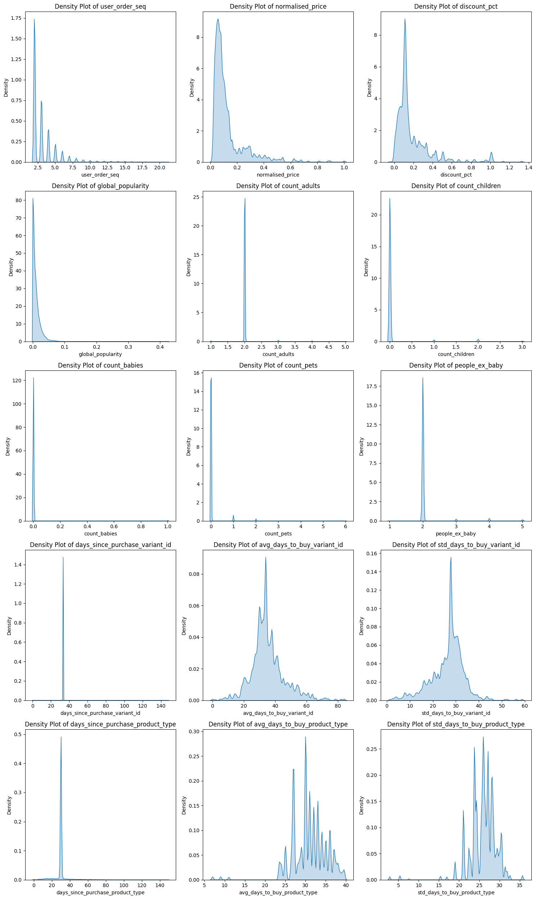
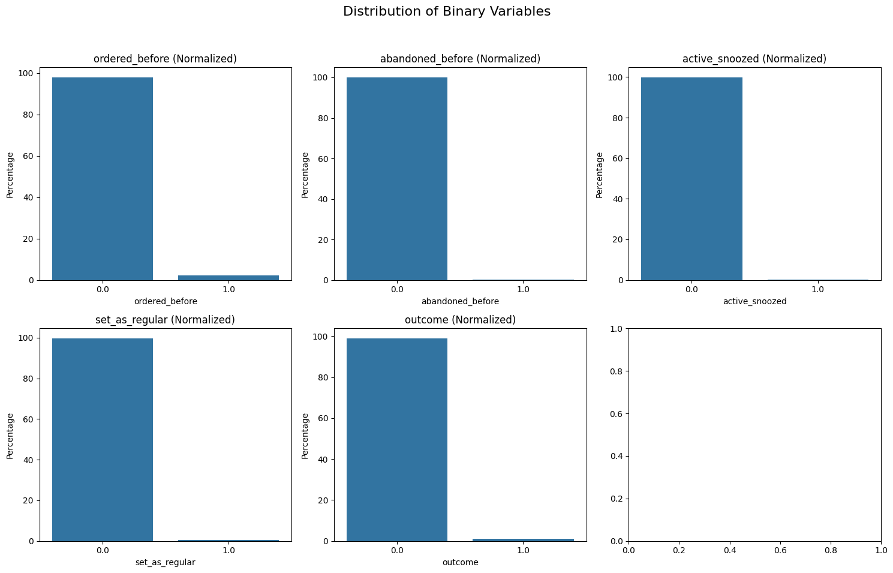
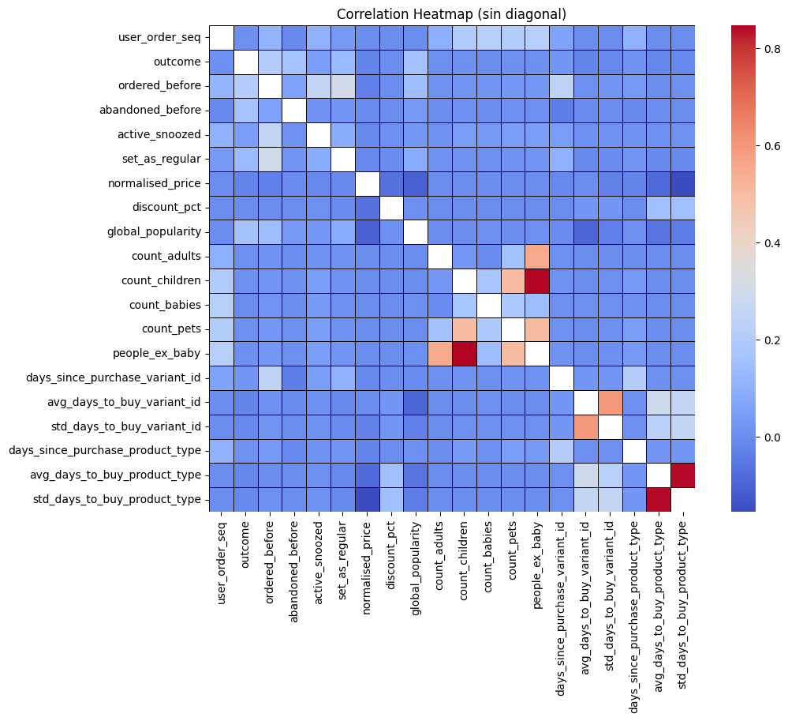
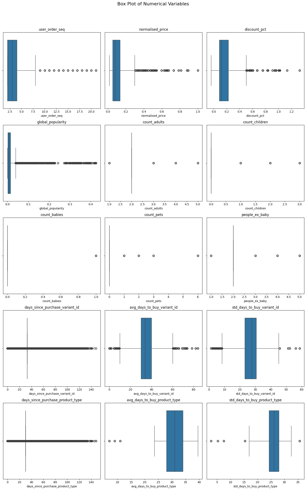

# 2. Exploratory Data Analysis

### 2.1 - First Data Inspection


```python
import pandas as pd
import matplotlib.pyplot as plt
import seaborn as sns
import numpy as np
```


```python
data = "/home/pedrotejero/zrive-ds/data/groceries/box_builder_dataset/feature_frame.csv"
df = pd.read_csv(data)
```


```python
df.head(10)
```


<div>
<style scoped>
    .dataframe tbody tr th:only-of-type {
        vertical-align: middle;
    }

    .dataframe tbody tr th {
        vertical-align: top;
    }

    .dataframe thead th {
        text-align: right;
    }
</style>
<table border="1" class="dataframe">
  <thead>
    <tr style="text-align: right;">
      <th></th>
      <th>variant_id</th>
      <th>product_type</th>
      <th>order_id</th>
      <th>user_id</th>
      <th>created_at</th>
      <th>order_date</th>
      <th>user_order_seq</th>
      <th>outcome</th>
      <th>ordered_before</th>
      <th>abandoned_before</th>
      <th>...</th>
      <th>count_children</th>
      <th>count_babies</th>
      <th>count_pets</th>
      <th>people_ex_baby</th>
      <th>days_since_purchase_variant_id</th>
      <th>avg_days_to_buy_variant_id</th>
      <th>std_days_to_buy_variant_id</th>
      <th>days_since_purchase_product_type</th>
      <th>avg_days_to_buy_product_type</th>
      <th>std_days_to_buy_product_type</th>
    </tr>
  </thead>
  <tbody>
    <tr>
      <th>0</th>
      <td>33826472919172</td>
      <td>ricepastapulses</td>
      <td>2807985930372</td>
      <td>3482464092292</td>
      <td>2020-10-05 16:46:19</td>
      <td>2020-10-05 00:00:00</td>
      <td>3</td>
      <td>0.0</td>
      <td>0.0</td>
      <td>0.0</td>
      <td>...</td>
      <td>0.0</td>
      <td>0.0</td>
      <td>0.0</td>
      <td>2.0</td>
      <td>33.0</td>
      <td>42.0</td>
      <td>31.134053</td>
      <td>30.0</td>
      <td>30.0</td>
      <td>24.27618</td>
    </tr>
    <tr>
      <th>1</th>
      <td>33826472919172</td>
      <td>ricepastapulses</td>
      <td>2808027644036</td>
      <td>3466586718340</td>
      <td>2020-10-05 17:59:51</td>
      <td>2020-10-05 00:00:00</td>
      <td>2</td>
      <td>0.0</td>
      <td>0.0</td>
      <td>0.0</td>
      <td>...</td>
      <td>0.0</td>
      <td>0.0</td>
      <td>0.0</td>
      <td>2.0</td>
      <td>33.0</td>
      <td>42.0</td>
      <td>31.134053</td>
      <td>30.0</td>
      <td>30.0</td>
      <td>24.27618</td>
    </tr>
    <tr>
      <th>2</th>
      <td>33826472919172</td>
      <td>ricepastapulses</td>
      <td>2808099078276</td>
      <td>3481384026244</td>
      <td>2020-10-05 20:08:53</td>
      <td>2020-10-05 00:00:00</td>
      <td>4</td>
      <td>0.0</td>
      <td>0.0</td>
      <td>0.0</td>
      <td>...</td>
      <td>0.0</td>
      <td>0.0</td>
      <td>0.0</td>
      <td>2.0</td>
      <td>33.0</td>
      <td>42.0</td>
      <td>31.134053</td>
      <td>30.0</td>
      <td>30.0</td>
      <td>24.27618</td>
    </tr>
    <tr>
      <th>3</th>
      <td>33826472919172</td>
      <td>ricepastapulses</td>
      <td>2808393957508</td>
      <td>3291363377284</td>
      <td>2020-10-06 08:57:59</td>
      <td>2020-10-06 00:00:00</td>
      <td>2</td>
      <td>0.0</td>
      <td>0.0</td>
      <td>0.0</td>
      <td>...</td>
      <td>0.0</td>
      <td>0.0</td>
      <td>0.0</td>
      <td>2.0</td>
      <td>33.0</td>
      <td>42.0</td>
      <td>31.134053</td>
      <td>30.0</td>
      <td>30.0</td>
      <td>24.27618</td>
    </tr>
    <tr>
      <th>4</th>
      <td>33826472919172</td>
      <td>ricepastapulses</td>
      <td>2808429314180</td>
      <td>3537167515780</td>
      <td>2020-10-06 10:37:05</td>
      <td>2020-10-06 00:00:00</td>
      <td>3</td>
      <td>0.0</td>
      <td>0.0</td>
      <td>0.0</td>
      <td>...</td>
      <td>0.0</td>
      <td>0.0</td>
      <td>0.0</td>
      <td>2.0</td>
      <td>33.0</td>
      <td>42.0</td>
      <td>31.134053</td>
      <td>30.0</td>
      <td>30.0</td>
      <td>24.27618</td>
    </tr>
    <tr>
      <th>5</th>
      <td>33826472919172</td>
      <td>ricepastapulses</td>
      <td>2808434524292</td>
      <td>3479090790532</td>
      <td>2020-10-06 10:50:23</td>
      <td>2020-10-06 00:00:00</td>
      <td>3</td>
      <td>0.0</td>
      <td>0.0</td>
      <td>0.0</td>
      <td>...</td>
      <td>0.0</td>
      <td>0.0</td>
      <td>0.0</td>
      <td>2.0</td>
      <td>33.0</td>
      <td>42.0</td>
      <td>31.134053</td>
      <td>30.0</td>
      <td>30.0</td>
      <td>24.27618</td>
    </tr>
    <tr>
      <th>6</th>
      <td>33826472919172</td>
      <td>ricepastapulses</td>
      <td>2808548917380</td>
      <td>3476645445764</td>
      <td>2020-10-06 14:23:08</td>
      <td>2020-10-06 00:00:00</td>
      <td>5</td>
      <td>0.0</td>
      <td>1.0</td>
      <td>0.0</td>
      <td>...</td>
      <td>0.0</td>
      <td>0.0</td>
      <td>0.0</td>
      <td>2.0</td>
      <td>33.0</td>
      <td>42.0</td>
      <td>31.134053</td>
      <td>30.0</td>
      <td>30.0</td>
      <td>24.27618</td>
    </tr>
    <tr>
      <th>7</th>
      <td>33826472919172</td>
      <td>ricepastapulses</td>
      <td>2808549900420</td>
      <td>3437017956484</td>
      <td>2020-10-06 14:24:26</td>
      <td>2020-10-06 00:00:00</td>
      <td>13</td>
      <td>0.0</td>
      <td>0.0</td>
      <td>0.0</td>
      <td>...</td>
      <td>0.0</td>
      <td>0.0</td>
      <td>0.0</td>
      <td>2.0</td>
      <td>33.0</td>
      <td>42.0</td>
      <td>31.134053</td>
      <td>30.0</td>
      <td>30.0</td>
      <td>24.27618</td>
    </tr>
    <tr>
      <th>8</th>
      <td>33826472919172</td>
      <td>ricepastapulses</td>
      <td>2808673927300</td>
      <td>3539005440132</td>
      <td>2020-10-06 17:57:23</td>
      <td>2020-10-06 00:00:00</td>
      <td>2</td>
      <td>0.0</td>
      <td>0.0</td>
      <td>0.0</td>
      <td>...</td>
      <td>0.0</td>
      <td>0.0</td>
      <td>0.0</td>
      <td>2.0</td>
      <td>33.0</td>
      <td>42.0</td>
      <td>31.134053</td>
      <td>30.0</td>
      <td>30.0</td>
      <td>24.27618</td>
    </tr>
    <tr>
      <th>9</th>
      <td>33826472919172</td>
      <td>ricepastapulses</td>
      <td>2808728715396</td>
      <td>3421126885508</td>
      <td>2020-10-06 19:36:06</td>
      <td>2020-10-06 00:00:00</td>
      <td>2</td>
      <td>0.0</td>
      <td>0.0</td>
      <td>0.0</td>
      <td>...</td>
      <td>0.0</td>
      <td>0.0</td>
      <td>0.0</td>
      <td>2.0</td>
      <td>33.0</td>
      <td>42.0</td>
      <td>31.134053</td>
      <td>30.0</td>
      <td>30.0</td>
      <td>24.27618</td>
    </tr>
  </tbody>
</table>
<p>10 rows × 27 columns</p>
</div>


```python
df.shape
```


    (2880549, 27)


We have a dataset with 27 variables and more than two millions rows.


```python
df.info()
```

    <class 'pandas.core.frame.DataFrame'>
    RangeIndex: 2880549 entries, 0 to 2880548
    Data columns (total 27 columns):
     #   Column                            Dtype  
    ---  ------                            -----  
     0   variant_id                        int64  
     1   product_type                      object 
     2   order_id                          int64  
     3   user_id                           int64  
     4   created_at                        object 
     5   order_date                        object 
     6   user_order_seq                    int64  
     7   outcome                           float64
     8   ordered_before                    float64
     9   abandoned_before                  float64
     10  active_snoozed                    float64
     11  set_as_regular                    float64
     12  normalised_price                  float64
     13  discount_pct                      float64
     14  vendor                            object 
     15  global_popularity                 float64
     16  count_adults                      float64
     17  count_children                    float64
     18  count_babies                      float64
     19  count_pets                        float64
     20  people_ex_baby                    float64
     21  days_since_purchase_variant_id    float64
     22  avg_days_to_buy_variant_id        float64
     23  std_days_to_buy_variant_id        float64
     24  days_since_purchase_product_type  float64
     25  avg_days_to_buy_product_type      float64
     26  std_days_to_buy_product_type      float64
    dtypes: float64(19), int64(4), object(4)
    memory usage: 593.4+ MB


```python
print("Example of a row:")
print("Variables                                    Values")
print("-----------------------------------------------------")
print(df.iloc[0])
```

    Example of a row:
    Variables                                    Values
    -----------------------------------------------------
    variant_id                               33826472919172
    product_type                            ricepastapulses
    order_id                                  2807985930372
    user_id                                   3482464092292
    created_at                          2020-10-05 16:46:19
    order_date                          2020-10-05 00:00:00
    user_order_seq                                        3
    outcome                                             0.0
    ordered_before                                      0.0
    abandoned_before                                    0.0
    active_snoozed                                      0.0
    set_as_regular                                      0.0
    normalised_price                               0.081052
    discount_pct                                   0.053512
    vendor                                      clearspring
    global_popularity                                   0.0
    count_adults                                        2.0
    count_children                                      0.0
    count_babies                                        0.0
    count_pets                                          0.0
    people_ex_baby                                      2.0
    days_since_purchase_variant_id                     33.0
    avg_days_to_buy_variant_id                         42.0
    std_days_to_buy_variant_id                    31.134053
    days_since_purchase_product_type                   30.0
    avg_days_to_buy_product_type                       30.0
    std_days_to_buy_product_type                   24.27618
    Name: 0, dtype: object


We can see two categorical variables: *product_type* and *vendor*


```python
categorical = ["product_type", "vendor"]
```

There are other features that only indicate the product and order each row refers to. I will call these *info_features*.


```python
info_features = ["variant_id", "order_id", "user_id", "created_at", "order_date"]
```


```python
numerical = [val for val in df.columns if val not in categorical + info_features]
```


```python
df[numerical].info()
```

    <class 'pandas.core.frame.DataFrame'>
    RangeIndex: 2880549 entries, 0 to 2880548
    Data columns (total 20 columns):
     #   Column                            Dtype  
    ---  ------                            -----  
     0   user_order_seq                    int64  
     1   outcome                           float64
     2   ordered_before                    float64
     3   abandoned_before                  float64
     4   active_snoozed                    float64
     5   set_as_regular                    float64
     6   normalised_price                  float64
     7   discount_pct                      float64
     8   global_popularity                 float64
     9   count_adults                      float64
     10  count_children                    float64
     11  count_babies                      float64
     12  count_pets                        float64
     13  people_ex_baby                    float64
     14  days_since_purchase_variant_id    float64
     15  avg_days_to_buy_variant_id        float64
     16  std_days_to_buy_variant_id        float64
     17  days_since_purchase_product_type  float64
     18  avg_days_to_buy_product_type      float64
     19  std_days_to_buy_product_type      float64
    dtypes: float64(19), int64(1)
    memory usage: 439.5 MB


```python
df[numerical].describe()
```


<div>
<style scoped>
    .dataframe tbody tr th:only-of-type {
        vertical-align: middle;
    }

    .dataframe tbody tr th {
        vertical-align: top;
    }

    .dataframe thead th {
        text-align: right;
    }
</style>
<table border="1" class="dataframe">
  <thead>
    <tr style="text-align: right;">
      <th></th>
      <th>user_order_seq</th>
      <th>outcome</th>
      <th>ordered_before</th>
      <th>abandoned_before</th>
      <th>active_snoozed</th>
      <th>set_as_regular</th>
      <th>normalised_price</th>
      <th>discount_pct</th>
      <th>global_popularity</th>
      <th>count_adults</th>
      <th>count_children</th>
      <th>count_babies</th>
      <th>count_pets</th>
      <th>people_ex_baby</th>
      <th>days_since_purchase_variant_id</th>
      <th>avg_days_to_buy_variant_id</th>
      <th>std_days_to_buy_variant_id</th>
      <th>days_since_purchase_product_type</th>
      <th>avg_days_to_buy_product_type</th>
      <th>std_days_to_buy_product_type</th>
    </tr>
  </thead>
  <tbody>
    <tr>
      <th>count</th>
      <td>2.880549e+06</td>
      <td>2.880549e+06</td>
      <td>2.880549e+06</td>
      <td>2.880549e+06</td>
      <td>2.880549e+06</td>
      <td>2.880549e+06</td>
      <td>2.880549e+06</td>
      <td>2.880549e+06</td>
      <td>2.880549e+06</td>
      <td>2.880549e+06</td>
      <td>2.880549e+06</td>
      <td>2.880549e+06</td>
      <td>2.880549e+06</td>
      <td>2.880549e+06</td>
      <td>2.880549e+06</td>
      <td>2.880549e+06</td>
      <td>2.880549e+06</td>
      <td>2.880549e+06</td>
      <td>2.880549e+06</td>
      <td>2.880549e+06</td>
    </tr>
    <tr>
      <th>mean</th>
      <td>3.289342e+00</td>
      <td>1.153669e-02</td>
      <td>2.113868e-02</td>
      <td>6.092589e-04</td>
      <td>2.290188e-03</td>
      <td>3.629864e-03</td>
      <td>1.272808e-01</td>
      <td>1.862744e-01</td>
      <td>1.070302e-02</td>
      <td>2.017627e+00</td>
      <td>5.492182e-02</td>
      <td>3.538562e-03</td>
      <td>5.134091e-02</td>
      <td>2.072549e+00</td>
      <td>3.312961e+01</td>
      <td>3.523734e+01</td>
      <td>2.645304e+01</td>
      <td>3.143513e+01</td>
      <td>3.088810e+01</td>
      <td>2.594969e+01</td>
    </tr>
    <tr>
      <th>std</th>
      <td>2.140176e+00</td>
      <td>1.067876e-01</td>
      <td>1.438466e-01</td>
      <td>2.467565e-02</td>
      <td>4.780109e-02</td>
      <td>6.013891e-02</td>
      <td>1.268378e-01</td>
      <td>1.934480e-01</td>
      <td>1.663389e-02</td>
      <td>2.098915e-01</td>
      <td>3.276586e-01</td>
      <td>5.938048e-02</td>
      <td>3.013646e-01</td>
      <td>3.943659e-01</td>
      <td>3.707162e+00</td>
      <td>1.057766e+01</td>
      <td>7.168323e+00</td>
      <td>1.227511e+01</td>
      <td>4.330262e+00</td>
      <td>3.278860e+00</td>
    </tr>
    <tr>
      <th>min</th>
      <td>2.000000e+00</td>
      <td>0.000000e+00</td>
      <td>0.000000e+00</td>
      <td>0.000000e+00</td>
      <td>0.000000e+00</td>
      <td>0.000000e+00</td>
      <td>1.599349e-02</td>
      <td>-4.016064e-02</td>
      <td>0.000000e+00</td>
      <td>1.000000e+00</td>
      <td>0.000000e+00</td>
      <td>0.000000e+00</td>
      <td>0.000000e+00</td>
      <td>1.000000e+00</td>
      <td>0.000000e+00</td>
      <td>0.000000e+00</td>
      <td>1.414214e+00</td>
      <td>0.000000e+00</td>
      <td>7.000000e+00</td>
      <td>2.828427e+00</td>
    </tr>
    <tr>
      <th>25%</th>
      <td>2.000000e+00</td>
      <td>0.000000e+00</td>
      <td>0.000000e+00</td>
      <td>0.000000e+00</td>
      <td>0.000000e+00</td>
      <td>0.000000e+00</td>
      <td>5.394416e-02</td>
      <td>8.462238e-02</td>
      <td>1.628664e-03</td>
      <td>2.000000e+00</td>
      <td>0.000000e+00</td>
      <td>0.000000e+00</td>
      <td>0.000000e+00</td>
      <td>2.000000e+00</td>
      <td>3.300000e+01</td>
      <td>3.000000e+01</td>
      <td>2.319372e+01</td>
      <td>3.000000e+01</td>
      <td>2.800000e+01</td>
      <td>2.427618e+01</td>
    </tr>
    <tr>
      <th>50%</th>
      <td>3.000000e+00</td>
      <td>0.000000e+00</td>
      <td>0.000000e+00</td>
      <td>0.000000e+00</td>
      <td>0.000000e+00</td>
      <td>0.000000e+00</td>
      <td>8.105178e-02</td>
      <td>1.169176e-01</td>
      <td>6.284368e-03</td>
      <td>2.000000e+00</td>
      <td>0.000000e+00</td>
      <td>0.000000e+00</td>
      <td>0.000000e+00</td>
      <td>2.000000e+00</td>
      <td>3.300000e+01</td>
      <td>3.400000e+01</td>
      <td>2.769305e+01</td>
      <td>3.000000e+01</td>
      <td>3.100000e+01</td>
      <td>2.608188e+01</td>
    </tr>
    <tr>
      <th>75%</th>
      <td>4.000000e+00</td>
      <td>0.000000e+00</td>
      <td>0.000000e+00</td>
      <td>0.000000e+00</td>
      <td>0.000000e+00</td>
      <td>0.000000e+00</td>
      <td>1.352670e-01</td>
      <td>2.234637e-01</td>
      <td>1.418440e-02</td>
      <td>2.000000e+00</td>
      <td>0.000000e+00</td>
      <td>0.000000e+00</td>
      <td>0.000000e+00</td>
      <td>2.000000e+00</td>
      <td>3.300000e+01</td>
      <td>4.000000e+01</td>
      <td>3.059484e+01</td>
      <td>3.000000e+01</td>
      <td>3.400000e+01</td>
      <td>2.796118e+01</td>
    </tr>
    <tr>
      <th>max</th>
      <td>2.100000e+01</td>
      <td>1.000000e+00</td>
      <td>1.000000e+00</td>
      <td>1.000000e+00</td>
      <td>1.000000e+00</td>
      <td>1.000000e+00</td>
      <td>1.000000e+00</td>
      <td>1.325301e+00</td>
      <td>4.254386e-01</td>
      <td>5.000000e+00</td>
      <td>3.000000e+00</td>
      <td>1.000000e+00</td>
      <td>6.000000e+00</td>
      <td>5.000000e+00</td>
      <td>1.480000e+02</td>
      <td>8.400000e+01</td>
      <td>5.868986e+01</td>
      <td>1.480000e+02</td>
      <td>3.950000e+01</td>
      <td>3.564191e+01</td>
    </tr>
  </tbody>
</table>
</div>


It is important to highlight that among all the numerical variables, we have 5 that are binary, including the target variable. Therefore, we are dealing with a **binary classification** problem.


```python
target = "outcome"
binary = ["ordered_before", "abandoned_before", "active_snoozed", "set_as_regular"]
```

### 2.2 Data Quality Assessment

- **Missing Values**


```python
df.isnull().sum()
```


    variant_id                          0
    product_type                        0
    order_id                            0
    user_id                             0
    created_at                          0
    order_date                          0
    user_order_seq                      0
    outcome                             0
    ordered_before                      0
    abandoned_before                    0
    active_snoozed                      0
    set_as_regular                      0
    normalised_price                    0
    discount_pct                        0
    vendor                              0
    global_popularity                   0
    count_adults                        0
    count_children                      0
    count_babies                        0
    count_pets                          0
    people_ex_baby                      0
    days_since_purchase_variant_id      0
    avg_days_to_buy_variant_id          0
    std_days_to_buy_variant_id          0
    days_since_purchase_product_type    0
    avg_days_to_buy_product_type        0
    std_days_to_buy_product_type        0
    dtype: int64


```python
df.isna().sum()
```


    variant_id                          0
    product_type                        0
    order_id                            0
    user_id                             0
    created_at                          0
    order_date                          0
    user_order_seq                      0
    outcome                             0
    ordered_before                      0
    abandoned_before                    0
    active_snoozed                      0
    set_as_regular                      0
    normalised_price                    0
    discount_pct                        0
    vendor                              0
    global_popularity                   0
    count_adults                        0
    count_children                      0
    count_babies                        0
    count_pets                          0
    people_ex_baby                      0
    days_since_purchase_variant_id      0
    avg_days_to_buy_variant_id          0
    std_days_to_buy_variant_id          0
    days_since_purchase_product_type    0
    avg_days_to_buy_product_type        0
    std_days_to_buy_product_type        0
    dtype: int64


- **Duplicates**


```python
df.duplicated(["variant_id", "order_id"]).sum()
```


    0


```python
df.duplicated().sum()
```


    0


- **Inconsistencies**


```python
print(type(df.created_at[0]))
print(type(df.order_date[0]))
```

    <class 'str'>
    <class 'str'>


```python
df['order_date'] = pd.to_datetime(df['order_date'])
df['created_at'] = pd.to_datetime(df['created_at'])
```


```python
df[numerical].info()
```

    <class 'pandas.core.frame.DataFrame'>
    RangeIndex: 2880549 entries, 0 to 2880548
    Data columns (total 20 columns):
     #   Column                            Dtype  
    ---  ------                            -----  
     0   user_order_seq                    int64  
     1   outcome                           float64
     2   ordered_before                    float64
     3   abandoned_before                  float64
     4   active_snoozed                    float64
     5   set_as_regular                    float64
     6   normalised_price                  float64
     7   discount_pct                      float64
     8   global_popularity                 float64
     9   count_adults                      float64
     10  count_children                    float64
     11  count_babies                      float64
     12  count_pets                        float64
     13  people_ex_baby                    float64
     14  days_since_purchase_variant_id    float64
     15  avg_days_to_buy_variant_id        float64
     16  std_days_to_buy_variant_id        float64
     17  days_since_purchase_product_type  float64
     18  avg_days_to_buy_product_type      float64
     19  std_days_to_buy_product_type      float64
    dtypes: float64(19), int64(1)
    memory usage: 439.5 MB


```python
for col in numerical:
    print(f"Column: {col} | Min: {df[col].min()} | Max: {df[col].max()}")
```

    Column: user_order_seq | Min: 2 | Max: 21
    Column: outcome | Min: 0.0 | Max: 1.0
    Column: ordered_before | Min: 0.0 | Max: 1.0
    Column: abandoned_before | Min: 0.0 | Max: 1.0
    Column: active_snoozed | Min: 0.0 | Max: 1.0
    Column: set_as_regular | Min: 0.0 | Max: 1.0
    Column: normalised_price | Min: 0.0159934941718622 | Max: 1.0
    Column: discount_pct | Min: -0.0401606425702811 | Max: 1.325301204819277
    Column: global_popularity | Min: 0.0 | Max: 0.425438596491228
    Column: count_adults | Min: 1.0 | Max: 5.0
    Column: count_children | Min: 0.0 | Max: 3.0
    Column: count_babies | Min: 0.0 | Max: 1.0
    Column: count_pets | Min: 0.0 | Max: 6.0
    Column: people_ex_baby | Min: 1.0 | Max: 5.0
    Column: days_since_purchase_variant_id | Min: 0.0 | Max: 148.0
    Column: avg_days_to_buy_variant_id | Min: 0.0 | Max: 84.0
    Column: std_days_to_buy_variant_id | Min: 1.4142135623730951 | Max: 58.68986283848344
    Column: days_since_purchase_product_type | Min: 0.0 | Max: 148.0
    Column: avg_days_to_buy_product_type | Min: 7.0 | Max: 39.5
    Column: std_days_to_buy_product_type | Min: 2.8284271247461903 | Max: 35.641907752465976


At first glance, I don't see any clear inconsistencies in the data.

### 2.3 Univariate Analysis

- **Numerical Features**


```python
numerical_without_binary = [val for val in numerical if val not in (binary+[target])]
```


```python
cols = 3
rows = int(np.ceil(len(numerical_without_binary) / cols))

fig, axes = plt.subplots(rows, cols, figsize=(15, 5 * rows))
for i, col in enumerate(numerical_without_binary):
    ax = axes[i // cols, i % cols]
    sns.kdeplot(df[col], ax=ax, fill=True)
    ax.set_title(f"Density Plot of {col}")
    ax.set_xlabel(col)
    ax.set_ylabel("Density")
plt.tight_layout()
plt.show()
```


    

    


The large spikes that appear in the distributions could be due to the imputation of missing values.

- **Binary Variables**


```python
cols = 3
rows = int(np.ceil((len(binary) + 1) / cols))

fig, axes = plt.subplots(rows, cols, figsize=(15, 5 * rows))
for i, col in enumerate(binary + [target]):
    ax = axes[i // cols, i % cols]
    sns.countplot(x=col, data=df, ax=ax, stat="percent")
    ax.set_title(f"{col} (Normalized)")
    ax.set_xlabel(col)
    ax.set_ylabel("Percentage")
fig.suptitle("Distribution of Binary Variables", fontsize=16)
plt.tight_layout(rect=[0, 0.03, 1, 0.95])
plt.show()


```


    

    


As we can see, binary features are **extremely disbalanced**.

- **Categorical Features**


```python
for col in categorical:
    print(f"Column: {col} | Unique Values: {df[col].nunique()}")
    print(f"Column: {col} | Most Frequent Value: {df[col].mode()[0]} | Count: {df[col].value_counts().max()} | Percentage: {df[col].value_counts(normalize=True).max() * 100:.2f}%")
    print(f"Column: {col} | Least Frequent Value: {df[col].value_counts().idxmin()} | Count: {df[col].value_counts().min()} | Percentage: {df[col].value_counts(normalize=True).min() * 100:.2f}%")
    print("-----------------------------------------------------")
```

    Column: product_type | Unique Values: 62
    Column: product_type | Most Frequent Value: tinspackagedfoods | Count: 226474 | Percentage: 7.86%
    Column: product_type | Least Frequent Value: premixedcocktails | Count: 2620 | Percentage: 0.09%
    -----------------------------------------------------
    Column: vendor | Unique Values: 264
    Column: vendor | Most Frequent Value: biona | Count: 146828 | Percentage: 5.10%
    Column: vendor | Least Frequent Value: vicks | Count: 243 | Percentage: 0.01%
    -----------------------------------------------------


We are dealing with two features with high cardinality, so we need to rule out one-hot/dummy encoding methods right away.

### 2.4 Multivariate Analysis


```python
corr = df[numerical].corr()
mask = np.eye(len(corr), dtype=bool)

plt.figure(figsize=(12, 8))
sns.heatmap(corr, 
            mask=mask,
            cmap="coolwarm", 
            square=True, 
            linewidths=0.5, 
            linecolor='black')
plt.title("Correlation Heatmap (sin diagonal)")
plt.show()

```


    

    


### 2.5 Outlier Detection


```python
cols = 3
rows = int(np.ceil(len(numerical_without_binary) / cols))

fig, axes = plt.subplots(rows, cols, figsize=(15, 5 * rows))
for i, col in enumerate(numerical_without_binary):
    ax = axes[i // cols, i % cols]
    sns.boxplot(data=df, x=col, ax=ax, whis=2)
    ax.set_title(f"{col}")
    ax.set_xlabel(col)
plt.suptitle("Box Plot of Numerical Variables", fontsize=16)
plt.tight_layout(rect=[0, 0.03, 1, 0.95])
plt.show()
```


    

    


#### **Conclusions**
- Widespread presence of outliers → Long tails in the distributions.
- Variables highly left-skewed (values concentrated in low ranges). Ex: user_order_seq, normalised_price
- "count_*" discrete numerical variables → indicate outliers more due to class dispersion than actual anomalies.


```python
!jupyter nbconvert --to markdown "2_eda.ipynb"
```
