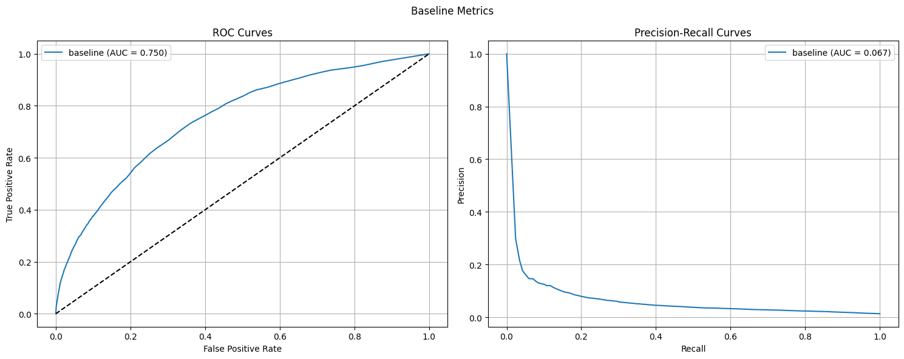

# Push Notifications DS Project

## Project Overview
The project aims to build a **targeted push notification system** for a grocery store app. The goal is to use a predictive machine learning model to identify users who are highly likely to purchase specific promotional items, then send them personalized push notifications. This approach seeks to boost sales while minimizing user churn from intrusive notifications (current open rate is ~5%).

## Key Requirements
- Target only users likely to make purchases of **at least 5 items** (due to shipping cost considerations)
- Enable sales operators to select items via dropdown/search and trigger customizable notifications
- Achieve a **2% increase in monthly sales** and **25% boost for selected items**
- Deliver a **Proof of Concept (PoC) within 1 week**

## Milestone 1 Scope
The first milestone focuses on the **exploration phase** of the data science component:

1. **Data Preparation**: Filter the existing groceries dataset (`feature_frame.csv`) to include only orders with 5+ items
2. **Model Development**: Build and evaluate linear models using train/validation/test splits (chosen for speed due to tight timeline)
3. **Model Selection**: Compare different approaches and select the best-performing model
4. **Documentation**: Deliver a comprehensive report/notebook documenting what worked, what didn't, and the reasoning behind decisions

The milestone should result in a **final model selection** ready for implementation in milestone 2, with the EDA phase skipped since the team has prior experience with this dataset.


```python
import numpy as np
import pandas as pd
import matplotlib.pyplot as plt
import seaborn as sns

from sklearn.metrics import (
    auc,
    average_precision_score,
    precision_recall_curve,
    roc_curve,
)
from sklearn.linear_model import LogisticRegression
from sklearn.discriminant_analysis import StandardScaler
from sklearn.pipeline import make_pipeline
```


```python
data_source = "/home/pedrotejero/zrive-ds/data/groceries/box_builder_dataset/feature_frame.csv"
df = pd.read_csv(data_source)
```


```python
df.head(10)
```


<div>
<style scoped>
    .dataframe tbody tr th:only-of-type {
        vertical-align: middle;
    }

    .dataframe tbody tr th {
        vertical-align: top;
    }

    .dataframe thead th {
        text-align: right;
    }
</style>
<table border="1" class="dataframe">
  <thead>
    <tr style="text-align: right;">
      <th></th>
      <th>variant_id</th>
      <th>product_type</th>
      <th>order_id</th>
      <th>user_id</th>
      <th>created_at</th>
      <th>order_date</th>
      <th>user_order_seq</th>
      <th>outcome</th>
      <th>ordered_before</th>
      <th>abandoned_before</th>
      <th>...</th>
      <th>count_children</th>
      <th>count_babies</th>
      <th>count_pets</th>
      <th>people_ex_baby</th>
      <th>days_since_purchase_variant_id</th>
      <th>avg_days_to_buy_variant_id</th>
      <th>std_days_to_buy_variant_id</th>
      <th>days_since_purchase_product_type</th>
      <th>avg_days_to_buy_product_type</th>
      <th>std_days_to_buy_product_type</th>
    </tr>
  </thead>
  <tbody>
    <tr>
      <th>0</th>
      <td>33826472919172</td>
      <td>ricepastapulses</td>
      <td>2807985930372</td>
      <td>3482464092292</td>
      <td>2020-10-05 16:46:19</td>
      <td>2020-10-05 00:00:00</td>
      <td>3</td>
      <td>0.0</td>
      <td>0.0</td>
      <td>0.0</td>
      <td>...</td>
      <td>0.0</td>
      <td>0.0</td>
      <td>0.0</td>
      <td>2.0</td>
      <td>33.0</td>
      <td>42.0</td>
      <td>31.134053</td>
      <td>30.0</td>
      <td>30.0</td>
      <td>24.27618</td>
    </tr>
    <tr>
      <th>1</th>
      <td>33826472919172</td>
      <td>ricepastapulses</td>
      <td>2808027644036</td>
      <td>3466586718340</td>
      <td>2020-10-05 17:59:51</td>
      <td>2020-10-05 00:00:00</td>
      <td>2</td>
      <td>0.0</td>
      <td>0.0</td>
      <td>0.0</td>
      <td>...</td>
      <td>0.0</td>
      <td>0.0</td>
      <td>0.0</td>
      <td>2.0</td>
      <td>33.0</td>
      <td>42.0</td>
      <td>31.134053</td>
      <td>30.0</td>
      <td>30.0</td>
      <td>24.27618</td>
    </tr>
    <tr>
      <th>2</th>
      <td>33826472919172</td>
      <td>ricepastapulses</td>
      <td>2808099078276</td>
      <td>3481384026244</td>
      <td>2020-10-05 20:08:53</td>
      <td>2020-10-05 00:00:00</td>
      <td>4</td>
      <td>0.0</td>
      <td>0.0</td>
      <td>0.0</td>
      <td>...</td>
      <td>0.0</td>
      <td>0.0</td>
      <td>0.0</td>
      <td>2.0</td>
      <td>33.0</td>
      <td>42.0</td>
      <td>31.134053</td>
      <td>30.0</td>
      <td>30.0</td>
      <td>24.27618</td>
    </tr>
    <tr>
      <th>3</th>
      <td>33826472919172</td>
      <td>ricepastapulses</td>
      <td>2808393957508</td>
      <td>3291363377284</td>
      <td>2020-10-06 08:57:59</td>
      <td>2020-10-06 00:00:00</td>
      <td>2</td>
      <td>0.0</td>
      <td>0.0</td>
      <td>0.0</td>
      <td>...</td>
      <td>0.0</td>
      <td>0.0</td>
      <td>0.0</td>
      <td>2.0</td>
      <td>33.0</td>
      <td>42.0</td>
      <td>31.134053</td>
      <td>30.0</td>
      <td>30.0</td>
      <td>24.27618</td>
    </tr>
    <tr>
      <th>4</th>
      <td>33826472919172</td>
      <td>ricepastapulses</td>
      <td>2808429314180</td>
      <td>3537167515780</td>
      <td>2020-10-06 10:37:05</td>
      <td>2020-10-06 00:00:00</td>
      <td>3</td>
      <td>0.0</td>
      <td>0.0</td>
      <td>0.0</td>
      <td>...</td>
      <td>0.0</td>
      <td>0.0</td>
      <td>0.0</td>
      <td>2.0</td>
      <td>33.0</td>
      <td>42.0</td>
      <td>31.134053</td>
      <td>30.0</td>
      <td>30.0</td>
      <td>24.27618</td>
    </tr>
    <tr>
      <th>5</th>
      <td>33826472919172</td>
      <td>ricepastapulses</td>
      <td>2808434524292</td>
      <td>3479090790532</td>
      <td>2020-10-06 10:50:23</td>
      <td>2020-10-06 00:00:00</td>
      <td>3</td>
      <td>0.0</td>
      <td>0.0</td>
      <td>0.0</td>
      <td>...</td>
      <td>0.0</td>
      <td>0.0</td>
      <td>0.0</td>
      <td>2.0</td>
      <td>33.0</td>
      <td>42.0</td>
      <td>31.134053</td>
      <td>30.0</td>
      <td>30.0</td>
      <td>24.27618</td>
    </tr>
    <tr>
      <th>6</th>
      <td>33826472919172</td>
      <td>ricepastapulses</td>
      <td>2808548917380</td>
      <td>3476645445764</td>
      <td>2020-10-06 14:23:08</td>
      <td>2020-10-06 00:00:00</td>
      <td>5</td>
      <td>0.0</td>
      <td>1.0</td>
      <td>0.0</td>
      <td>...</td>
      <td>0.0</td>
      <td>0.0</td>
      <td>0.0</td>
      <td>2.0</td>
      <td>33.0</td>
      <td>42.0</td>
      <td>31.134053</td>
      <td>30.0</td>
      <td>30.0</td>
      <td>24.27618</td>
    </tr>
    <tr>
      <th>7</th>
      <td>33826472919172</td>
      <td>ricepastapulses</td>
      <td>2808549900420</td>
      <td>3437017956484</td>
      <td>2020-10-06 14:24:26</td>
      <td>2020-10-06 00:00:00</td>
      <td>13</td>
      <td>0.0</td>
      <td>0.0</td>
      <td>0.0</td>
      <td>...</td>
      <td>0.0</td>
      <td>0.0</td>
      <td>0.0</td>
      <td>2.0</td>
      <td>33.0</td>
      <td>42.0</td>
      <td>31.134053</td>
      <td>30.0</td>
      <td>30.0</td>
      <td>24.27618</td>
    </tr>
    <tr>
      <th>8</th>
      <td>33826472919172</td>
      <td>ricepastapulses</td>
      <td>2808673927300</td>
      <td>3539005440132</td>
      <td>2020-10-06 17:57:23</td>
      <td>2020-10-06 00:00:00</td>
      <td>2</td>
      <td>0.0</td>
      <td>0.0</td>
      <td>0.0</td>
      <td>...</td>
      <td>0.0</td>
      <td>0.0</td>
      <td>0.0</td>
      <td>2.0</td>
      <td>33.0</td>
      <td>42.0</td>
      <td>31.134053</td>
      <td>30.0</td>
      <td>30.0</td>
      <td>24.27618</td>
    </tr>
    <tr>
      <th>9</th>
      <td>33826472919172</td>
      <td>ricepastapulses</td>
      <td>2808728715396</td>
      <td>3421126885508</td>
      <td>2020-10-06 19:36:06</td>
      <td>2020-10-06 00:00:00</td>
      <td>2</td>
      <td>0.0</td>
      <td>0.0</td>
      <td>0.0</td>
      <td>...</td>
      <td>0.0</td>
      <td>0.0</td>
      <td>0.0</td>
      <td>2.0</td>
      <td>33.0</td>
      <td>42.0</td>
      <td>31.134053</td>
      <td>30.0</td>
      <td>30.0</td>
      <td>24.27618</td>
    </tr>
  </tbody>
</table>
<p>10 rows × 27 columns</p>
</div>


```python
df.shape
```


    (2880549, 27)


```python
df.info()
```

    <class 'pandas.core.frame.DataFrame'>
    RangeIndex: 2880549 entries, 0 to 2880548
    Data columns (total 27 columns):
     #   Column                            Dtype  
    ---  ------                            -----  
     0   variant_id                        int64  
     1   product_type                      object 
     2   order_id                          int64  
     3   user_id                           int64  
     4   created_at                        object 
     5   order_date                        object 
     6   user_order_seq                    int64  
     7   outcome                           float64
     8   ordered_before                    float64
     9   abandoned_before                  float64
     10  active_snoozed                    float64
     11  set_as_regular                    float64
     12  normalised_price                  float64
     13  discount_pct                      float64
     14  vendor                            object 
     15  global_popularity                 float64
     16  count_adults                      float64
     17  count_children                    float64
     18  count_babies                      float64
     19  count_pets                        float64
     20  people_ex_baby                    float64
     21  days_since_purchase_variant_id    float64
     22  avg_days_to_buy_variant_id        float64
     23  std_days_to_buy_variant_id        float64
     24  days_since_purchase_product_type  float64
     25  avg_days_to_buy_product_type      float64
     26  std_days_to_buy_product_type      float64
    dtypes: float64(19), int64(4), object(4)
    memory usage: 593.4+ MB


## Filtering Data

Let's filter the dataset to keep only the orders with 5 or more products successfully sold.


```python
orders_with_outcome_1 = df[df['outcome'] == 1]

target_orders = orders_with_outcome_1.groupby('order_id')['variant_id'].nunique()
target_orders = target_orders[target_orders >= 5]
target_orders_list = target_orders.index.values
target_orders
```


    order_id
    2807985930372     9
    2808027644036     6
    2808099078276     9
    2808393957508    13
    2808434524292     7
                     ..
    3643241300100    10
    3643254800516     9
    3643274788996     5
    3643283734660    21
    3643294515332     7
    Name: variant_id, Length: 2603, dtype: int64


```python
data = df[df['order_id'].isin(target_orders_list)]

print("Original DataFrame shape: ", df.shape)
print("Data filtered shape: ", data.shape)

difference = df.shape[0] - data.shape[0]
print(f"Difference: {difference} rows removed, {round(difference/df.shape[0]*100, 2)}% of the data")
```

    Original DataFrame shape:  (2880549, 27)
    Data filtered shape:  (2163953, 27)
    Difference: 716596 rows removed, 24.88% of the data


## Splitting Data

Let's analyze the daily sales that have occurred over time.


```python
def process_data(data, percentage_to_remove=0.10):
    """
    Process the data by removing a percentage of first orders.
    
    Args:
        data (pd.DataFrame): Input dataframe
        percentage_to_remove (float): Percentage of first orders to remove (default: 0.10)
    
    Returns:
        tuple: (original_data, filtered_data, orders_to_remove)
    """
    data['order_date'] = pd.to_datetime(data['order_date'])
    data = data.sort_values(by='order_date', ascending=True)
    order_list = data['order_id'].unique()
    
    n_orders_to_remove = int(len(order_list) * percentage_to_remove)
    orders_to_remove = order_list[:n_orders_to_remove]
    
    original_data = data.copy()
    filtered_data = data[~data['order_id'].isin(orders_to_remove)].copy()
    
    return original_data, filtered_data, orders_to_remove

def calculate_daily_orders(data):
    """
    Calculate daily orders from the dataset.
    
    Args:
        data (pd.DataFrame): Input dataframe
    
    Returns:
        pd.Series: Daily orders count
    """
    return data.groupby('order_date')['order_id'].nunique()

def plot_daily_orders_comparison(daily_orders_original, daily_orders_filtered, percentage_to_remove):
    """
    Create a comparison plot of daily orders.
    
    Args:
        daily_orders_original (pd.Series): Original daily orders
        daily_orders_filtered (pd.Series): Filtered daily orders
        percentage_to_remove (float): Percentage of orders removed
    """
    plt.figure(figsize=(15, 6))
    plt.plot(daily_orders_original.index, daily_orders_original.values, 
             label='Original Orders', alpha=0.7)
    plt.plot(daily_orders_filtered.index, daily_orders_filtered.values, 
             label=f'Orders after removing {percentage_to_remove*100}% of first orders', alpha=0.7)
    plt.title('Comparison of Daily Orders: Original vs Filtered')
    plt.xlabel('Date')
    plt.ylabel('Number of Orders')
    plt.grid(True)
    plt.xticks(rotation=45)
    plt.legend()
    plt.tight_layout()
    plt.show()

def print_statistics(data, daily_orders, label):
    """
    Print statistics for a dataset.
    
    Args:
        data (pd.DataFrame): Input dataframe
        daily_orders (pd.Series): Daily orders series
        label (str): Label for the statistics section
    """
    print(f"\n{label}:")
    print(f"Average daily orders: {daily_orders.mean():.2f}")
    print(f"Maximum daily orders: {daily_orders.max()}")
    print(f"Minimum daily orders: {daily_orders.min()}")
    print(f"Total number of days: {len(daily_orders)}")
    print(f"Total number of orders: {len(data['order_id'].unique())}")
    print(f"Total number of entries: {len(data)}")

def filter_orders(data, percentage_to_remove=0.10):
    """
    Main function to filter orders data.
    
    Args:
        data (pd.DataFrame): Input dataframe
        percentage_to_remove (float): Percentage of first orders to remove (default: 0.10)
    """
    original_data, filtered_data, _ = process_data(data, percentage_to_remove)
    
    daily_orders_original = calculate_daily_orders(original_data)
    daily_orders_filtered = calculate_daily_orders(filtered_data)
    
    plot_daily_orders_comparison(daily_orders_original, daily_orders_filtered, percentage_to_remove)
    
    print_statistics(original_data, daily_orders_original, "Original Data")
    print_statistics(filtered_data, daily_orders_filtered, 
                     f"Filtered Data (after removing first {percentage_to_remove*100}% of orders)")
    
    return filtered_data
```


```python
df_filtered = filter_orders(data, percentage_to_remove=0.20)
```

    /tmp/ipykernel_9195/2855717595.py:12: SettingWithCopyWarning: 
    A value is trying to be set on a copy of a slice from a DataFrame.
    Try using .loc[row_indexer,col_indexer] = value instead
    
    See the caveats in the documentation: https://pandas.pydata.org/pandas-docs/stable/user_guide/indexing.html#returning-a-view-versus-a-copy
      data['order_date'] = pd.to_datetime(data['order_date'])


    

    


    
    Original Data:
    Average daily orders: 17.47
    Maximum daily orders: 50
    Minimum daily orders: 1
    Total number of days: 149
    Total number of orders: 2603
    Total number of entries: 2163953
    
    Filtered Data (after removing first 20.0% of orders):
    Average daily orders: 21.47
    Maximum daily orders: 50
    Minimum daily orders: 1
    Total number of days: 97
    Total number of orders: 2083
    Total number of entries: 1798640


As we can see, the business has been growing and in recent months daily sales are 3 or 4 times higher than at the beginning. Given that we have plenty of data to train a linear model, I'm making a design decision to remove a percentage of the initial data since I don't believe they represent the current reality of the business we're trying to predict, which could introduce noise into the model and worsen our results and predictive power.


```python
df_filtered = df_filtered.sort_values(by='order_date', ascending=True)
orders_list = df_filtered['order_id'].unique()
n_total = len(orders_list)
split_value = 0.75
cutoff = int(split_value * n_total)

train_split = orders_list[0:cutoff]
test_split = orders_list[cutoff:]

print(f"Total orders: {n_total}")
print(f"Train orders: {len(train_split)}")
print(f"Test orders: {len(test_split)}")
```

    Total orders: 2083
    Train orders: 1562
    Test orders: 521


```python
train_df = df_filtered[df_filtered['order_id'].isin(train_split)]
test_df = df_filtered[df_filtered['order_id'].isin(test_split)]

print(train_df.shape)
print(test_df.shape)

print(f"\nTrain since: {train_df['order_date'].min()}")
print(f"Train until: {train_df['order_date'].max()}")
print(f"Test since: {test_df['order_date'].min()}")
print(f"Test until: {test_df['order_date'].max()}")
```

    (1311238, 27)
    (487402, 27)
    
    Train since: 2020-11-26 00:00:00
    Train until: 2021-02-15 00:00:00
    Test since: 2021-02-15 00:00:00
    Test until: 2021-03-03 00:00:00


I don't use a validation dataset because when splitting the data temporally, the training data would be too far from the current data. Additionally, this way I ensure that test dataframe represents some weeks, gaining stability and robustness against specific temporal effects that could affect the model evaluation.

## Baseline
As a baseline, I have chosen the value of total sales for each product.


```python
product_sales = train_df.groupby('variant_id').apply(
    lambda x: x.loc[x['outcome'] == 1, 'order_id'].count()
)
product_sales
```

    /tmp/ipykernel_9195/2163194915.py:1: DeprecationWarning: DataFrameGroupBy.apply operated on the grouping columns. This behavior is deprecated, and in a future version of pandas the grouping columns will be excluded from the operation. Either pass `include_groups=False` to exclude the groupings or explicitly select the grouping columns after groupby to silence this warning.
      product_sales = train_df.groupby('variant_id').apply(


    variant_id
    33615294398596    17
    33667172466820     0
    33667174301828     7
    33667174334596     6
    33667174465668    35
                      ..
    34535159595140     1
    34535159660676     4
    34535159693444     1
    34535162118276     1
    34535162151044     6
    Length: 898, dtype: int64


```python
product_sales_norm = product_sales / product_sales.sum()
print(product_sales.sum())
print(product_sales_norm.sum())
product_sales_norm
```

    18572
    1.0


    variant_id
    33615294398596    0.000915
    33667172466820    0.000000
    33667174301828    0.000377
    33667174334596    0.000323
    33667174465668    0.001885
                        ...   
    34535159595140    0.000054
    34535159660676    0.000215
    34535159693444    0.000054
    34535162118276    0.000054
    34535162151044    0.000323
    Length: 898, dtype: float64


```python
baseline = test_df.copy().reset_index(drop=True)
baseline['probability'] = baseline['variant_id'].map(product_sales_norm).fillna(0)
baseline

```


<div>
<style scoped>
    .dataframe tbody tr th:only-of-type {
        vertical-align: middle;
    }

    .dataframe tbody tr th {
        vertical-align: top;
    }

    .dataframe thead th {
        text-align: right;
    }
</style>
<table border="1" class="dataframe">
  <thead>
    <tr style="text-align: right;">
      <th></th>
      <th>variant_id</th>
      <th>product_type</th>
      <th>order_id</th>
      <th>user_id</th>
      <th>created_at</th>
      <th>order_date</th>
      <th>user_order_seq</th>
      <th>outcome</th>
      <th>ordered_before</th>
      <th>abandoned_before</th>
      <th>...</th>
      <th>count_babies</th>
      <th>count_pets</th>
      <th>people_ex_baby</th>
      <th>days_since_purchase_variant_id</th>
      <th>avg_days_to_buy_variant_id</th>
      <th>std_days_to_buy_variant_id</th>
      <th>days_since_purchase_product_type</th>
      <th>avg_days_to_buy_product_type</th>
      <th>std_days_to_buy_product_type</th>
      <th>probability</th>
    </tr>
  </thead>
  <tbody>
    <tr>
      <th>0</th>
      <td>33826472919172</td>
      <td>ricepastapulses</td>
      <td>2922505601156</td>
      <td>3903061262468</td>
      <td>2021-02-15 07:51:04</td>
      <td>2021-02-15 00:00:00</td>
      <td>2</td>
      <td>0.0</td>
      <td>0.0</td>
      <td>0.0</td>
      <td>...</td>
      <td>0.0</td>
      <td>0.0</td>
      <td>2.0</td>
      <td>33.0</td>
      <td>42.0</td>
      <td>31.134053</td>
      <td>30.0</td>
      <td>30.0</td>
      <td>24.276180</td>
      <td>0.001292</td>
    </tr>
    <tr>
      <th>1</th>
      <td>33826472919172</td>
      <td>ricepastapulses</td>
      <td>2922529063044</td>
      <td>3828300021892</td>
      <td>2021-02-15 08:47:44</td>
      <td>2021-02-15 00:00:00</td>
      <td>5</td>
      <td>0.0</td>
      <td>0.0</td>
      <td>0.0</td>
      <td>...</td>
      <td>0.0</td>
      <td>0.0</td>
      <td>2.0</td>
      <td>33.0</td>
      <td>42.0</td>
      <td>31.134053</td>
      <td>11.0</td>
      <td>30.0</td>
      <td>24.276180</td>
      <td>0.001292</td>
    </tr>
    <tr>
      <th>2</th>
      <td>33826472919172</td>
      <td>ricepastapulses</td>
      <td>2922572218500</td>
      <td>3896491475076</td>
      <td>2021-02-15 10:51:59</td>
      <td>2021-02-15 00:00:00</td>
      <td>2</td>
      <td>0.0</td>
      <td>0.0</td>
      <td>0.0</td>
      <td>...</td>
      <td>0.0</td>
      <td>0.0</td>
      <td>2.0</td>
      <td>33.0</td>
      <td>42.0</td>
      <td>31.134053</td>
      <td>30.0</td>
      <td>30.0</td>
      <td>24.276180</td>
      <td>0.001292</td>
    </tr>
    <tr>
      <th>3</th>
      <td>33826472919172</td>
      <td>ricepastapulses</td>
      <td>2922586439812</td>
      <td>3786618634372</td>
      <td>2021-02-15 11:28:01</td>
      <td>2021-02-15 00:00:00</td>
      <td>4</td>
      <td>0.0</td>
      <td>0.0</td>
      <td>0.0</td>
      <td>...</td>
      <td>0.0</td>
      <td>0.0</td>
      <td>2.0</td>
      <td>33.0</td>
      <td>42.0</td>
      <td>31.134053</td>
      <td>30.0</td>
      <td>30.0</td>
      <td>24.276180</td>
      <td>0.001292</td>
    </tr>
    <tr>
      <th>4</th>
      <td>33826472919172</td>
      <td>ricepastapulses</td>
      <td>2922609672324</td>
      <td>3914472784004</td>
      <td>2021-02-15 12:25:20</td>
      <td>2021-02-15 00:00:00</td>
      <td>2</td>
      <td>0.0</td>
      <td>0.0</td>
      <td>0.0</td>
      <td>...</td>
      <td>0.0</td>
      <td>0.0</td>
      <td>2.0</td>
      <td>33.0</td>
      <td>42.0</td>
      <td>31.134053</td>
      <td>11.0</td>
      <td>30.0</td>
      <td>24.276180</td>
      <td>0.001292</td>
    </tr>
    <tr>
      <th>...</th>
      <td>...</td>
      <td>...</td>
      <td>...</td>
      <td>...</td>
      <td>...</td>
      <td>...</td>
      <td>...</td>
      <td>...</td>
      <td>...</td>
      <td>...</td>
      <td>...</td>
      <td>...</td>
      <td>...</td>
      <td>...</td>
      <td>...</td>
      <td>...</td>
      <td>...</td>
      <td>...</td>
      <td>...</td>
      <td>...</td>
      <td>...</td>
    </tr>
    <tr>
      <th>487397</th>
      <td>33826439594116</td>
      <td>healthcarevitamins</td>
      <td>3643241300100</td>
      <td>3864791220356</td>
      <td>2021-03-03 12:56:04</td>
      <td>2021-03-03 00:00:00</td>
      <td>2</td>
      <td>0.0</td>
      <td>0.0</td>
      <td>0.0</td>
      <td>...</td>
      <td>0.0</td>
      <td>0.0</td>
      <td>2.0</td>
      <td>33.0</td>
      <td>34.0</td>
      <td>27.693045</td>
      <td>30.0</td>
      <td>34.0</td>
      <td>27.451392</td>
      <td>0.000000</td>
    </tr>
    <tr>
      <th>487398</th>
      <td>33826439594116</td>
      <td>healthcarevitamins</td>
      <td>3643254800516</td>
      <td>3893722808452</td>
      <td>2021-03-03 13:19:28</td>
      <td>2021-03-03 00:00:00</td>
      <td>3</td>
      <td>0.0</td>
      <td>0.0</td>
      <td>0.0</td>
      <td>...</td>
      <td>0.0</td>
      <td>0.0</td>
      <td>2.0</td>
      <td>33.0</td>
      <td>34.0</td>
      <td>27.693045</td>
      <td>30.0</td>
      <td>34.0</td>
      <td>27.451392</td>
      <td>0.000000</td>
    </tr>
    <tr>
      <th>487399</th>
      <td>33826439594116</td>
      <td>healthcarevitamins</td>
      <td>3643274788996</td>
      <td>3883757174916</td>
      <td>2021-03-03 13:57:35</td>
      <td>2021-03-03 00:00:00</td>
      <td>4</td>
      <td>0.0</td>
      <td>0.0</td>
      <td>0.0</td>
      <td>...</td>
      <td>0.0</td>
      <td>0.0</td>
      <td>2.0</td>
      <td>33.0</td>
      <td>34.0</td>
      <td>27.693045</td>
      <td>30.0</td>
      <td>34.0</td>
      <td>27.451392</td>
      <td>0.000000</td>
    </tr>
    <tr>
      <th>487400</th>
      <td>33826439594116</td>
      <td>healthcarevitamins</td>
      <td>3643283734660</td>
      <td>3874925314180</td>
      <td>2021-03-03 14:14:24</td>
      <td>2021-03-03 00:00:00</td>
      <td>7</td>
      <td>0.0</td>
      <td>0.0</td>
      <td>0.0</td>
      <td>...</td>
      <td>0.0</td>
      <td>0.0</td>
      <td>2.0</td>
      <td>33.0</td>
      <td>34.0</td>
      <td>27.693045</td>
      <td>30.0</td>
      <td>34.0</td>
      <td>27.451392</td>
      <td>0.000000</td>
    </tr>
    <tr>
      <th>487401</th>
      <td>33826439594116</td>
      <td>healthcarevitamins</td>
      <td>3643294515332</td>
      <td>3906490826884</td>
      <td>2021-03-03 14:30:30</td>
      <td>2021-03-03 00:00:00</td>
      <td>2</td>
      <td>0.0</td>
      <td>0.0</td>
      <td>0.0</td>
      <td>...</td>
      <td>0.0</td>
      <td>0.0</td>
      <td>2.0</td>
      <td>33.0</td>
      <td>34.0</td>
      <td>27.693045</td>
      <td>30.0</td>
      <td>34.0</td>
      <td>27.451392</td>
      <td>0.000000</td>
    </tr>
  </tbody>
</table>
<p>487402 rows × 28 columns</p>
</div>


To evaluate the models, I have chosen ROC and Precision-Recall curves.

1. **ROC (Receiver Operating Characteristic) Curve**:
   - Shows the trade-off between True Positive Rate (Sensitivity) and False Positive Rate (1-Specificity)
   - Useful when:
     - You want to evaluate model performance across different classification thresholds
     - You need to compare models regardless of class distribution
     - You want to assess the model's ability to discriminate between classes
   - The Area Under the Curve (AUC-ROC) provides a single score for model comparison

2. **Precision-Recall Curve**:
   - Shows the trade-off between Precision and Recall
   - Particularly valuable when:
     - Have imbalanced classes
     - The cost of false positives and false negatives is different
     - You're more interested in the positive class (successful sales)
   - The Area Under the Curve (AUC-PR) is especially useful for imbalanced datasets


```python
def plot_evaluation_metrics(
    y_true,
    y_pred_probs_dict,
    figsize=(15, 6),
    title=None
):
    """
    Plot ROC and Precision-Recall curves for multiple models
    
    Parameters:
    -----------
    y_true : array-like
        True binary labels
    y_pred_probs_dict : dict
        Dictionary containing model names as keys and predicted probabilities as values
    figsize : tuple, optional
        Figure size (width, height)
    title : str, optional
        Title for the overall figure
    """

    fig, (ax1, ax2) = plt.subplots(1, 2, figsize=figsize)
    
    if title:
        fig.suptitle(title)
    
    # ROC Curve
    for model_name, y_pred_probs in y_pred_probs_dict.items():
        fpr, tpr, _ = roc_curve(y_true, y_pred_probs)
        roc_auc = auc(fpr, tpr)
        ax1.plot(fpr, tpr, label=f'{model_name} (AUC = {roc_auc:.3f})')
    
    ax1.plot([0, 1], [0, 1], 'k--')
    ax1.set_xlabel('False Positive Rate')
    ax1.set_ylabel('True Positive Rate')
    ax1.set_title('ROC Curves')
    ax1.legend()
    ax1.grid(True)
    
    # Precision-Recall Curve
    for model_name, y_pred_probs in y_pred_probs_dict.items():
        precision, recall, _ = precision_recall_curve(y_true, y_pred_probs)
        pr_auc = auc(recall, precision)
        ax2.plot(recall, precision, label=f'{model_name} (AUC = {pr_auc:.3f})')
    
    ax2.set_xlabel('Recall')
    ax2.set_ylabel('Precision')
    ax2.set_title('Precision-Recall Curves')
    ax2.legend()
    ax2.grid(True)
    
    plt.tight_layout()
    return fig, (ax1, ax2)
    
```


```python
models = {}

models["baseline"] = baseline['probability']
```


```python
plot_evaluation_metrics(
    y_true=test_df['outcome'],
    y_pred_probs_dict=models,
    title="Baseline Metrics")
```


    (<Figure size 1500x600 with 2 Axes>,
     (<Axes: title={'center': 'ROC Curves'}, xlabel='False Positive Rate', ylabel='True Positive Rate'>,
      <Axes: title={'center': 'Precision-Recall Curves'}, xlabel='Recall', ylabel='Precision'>))


    

    


## Model Training


```python
X_train, y_train = train_df.drop(columns=['outcome']), train_df['outcome']
X_test, y_test = test_df.drop(columns=['outcome']), test_df['outcome']

print(X_train.shape)
print(y_train.shape)
print(X_test.shape)
print(y_test.shape)
```

    (1311238, 26)
    (1311238,)
    (487402, 26)
    (487402,)


```python
binary_cols = [
    "ordered_before",
    "abandoned_before",
    "active_snoozed",
    "set_as_regular",
]

numerical_cols = [
    'user_order_seq',
    'normalised_price',
    'discount_pct',
    'global_popularity',
    'count_adults',
    'count_children',
    'count_babies',
    'count_pets',
    'people_ex_baby',
    'days_since_purchase_variant_id',
    'avg_days_to_buy_variant_id',
    'std_days_to_buy_variant_id',
    'days_since_purchase_product_type',
    'avg_days_to_buy_product_type',
    'std_days_to_buy_product_type',
]

categorical_cols = ["product_type", "vendor"]
```


```python
training_cols = binary_cols + numerical_cols
```

Since we are in a binary classification problem, I have selected **Logistic Regression** as the model.

I'm going to use `solver=saga` because I want to try the three types of regularization available. Scikit-learn documentation resume the following:

*The ‘newton-cg’, ‘sag’, and ‘lbfgs’ solvers support only L2 regularization with primal formulation, or no regularization. The ‘liblinear’ solver supports both L1 and L2 regularization, with a dual formulation only for the L2 penalty. The Elastic-Net regularization is only supported by the ‘saga’ solver.*

## Lasso


```python
lasso_train_results = {}
lasso_test_results = {}
lasso_test_results["baseline"] = baseline['probability']


cs = [1e-8, 1e-6, 1e-4, 1e-2, 1, 100, 1e4]
for c in cs:
    rl = make_pipeline(
        StandardScaler(),
        LogisticRegression(
            penalty='l1',
            C=c,
            solver='saga',
            )
    )
    rl.fit(X=X_train[training_cols], y=y_train)

    train_probs = rl.predict_proba(X_train[training_cols])[:, 1]
    lasso_train_results[f"c={c}"] = train_probs

    test_probs = rl.predict_proba(X_test[training_cols])[:, 1]
    lasso_test_results[f"c={c}"] = test_probs

```


```python
plot_evaluation_metrics(
    y_train,
    lasso_train_results,
    title="Train metrics",
    )
```


    (<Figure size 1500x600 with 2 Axes>,
     (<Axes: title={'center': 'ROC Curves'}, xlabel='False Positive Rate', ylabel='True Positive Rate'>,
      <Axes: title={'center': 'Precision-Recall Curves'}, xlabel='Recall', ylabel='Precision'>))


    

    


```python
plot_evaluation_metrics(
    y_test,
    lasso_test_results, 
    title="Test metrics",
    )
```


    (<Figure size 1500x600 with 2 Axes>,
     (<Axes: title={'center': 'ROC Curves'}, xlabel='False Positive Rate', ylabel='True Positive Rate'>,
      <Axes: title={'center': 'Precision-Recall Curves'}, xlabel='Recall', ylabel='Precision'>))


    

    


- Clearly the model improves upon the Baseline.
- There are no signs of overfitting since the results in train and test are very similar.
- I managed to improve a bit the result of the model that Guille presented in his solution (`AUC=0.83`)

## Ridge


```python
ridge_train_results = {}
ridge_test_results = {}
ridge_test_results["baseline"] = baseline['probability']


cs = [1e-8, 1e-6, 1e-4, 1e-2, 1, 100, 1e4]
for c in cs:
    rl = make_pipeline(
        StandardScaler(),
        LogisticRegression(
            penalty='l2',
            C=c,
            solver='saga',
            )
    )
    rl.fit(X=X_train[training_cols], y=y_train)

    train_probs = rl.predict_proba(X_train[training_cols])[:, 1]
    ridge_train_results[f"c={c}"] = train_probs

    test_probs = rl.predict_proba(X_test[training_cols])[:, 1]
    ridge_test_results[f"c={c}"] = test_probs
```


```python
plot_evaluation_metrics(
    y_train,
    ridge_train_results,
    title="Train metrics",
    )

plot_evaluation_metrics(
    y_test,
    ridge_test_results, 
    title="Test metrics",
    )
```


    (<Figure size 1500x600 with 2 Axes>,
     (<Axes: title={'center': 'ROC Curves'}, xlabel='False Positive Rate', ylabel='True Positive Rate'>,
      <Axes: title={'center': 'Precision-Recall Curves'}, xlabel='Recall', ylabel='Precision'>))


    

    


    

    


It improves upon the Baseline but doesn't improve upon Lasso.

## Elastic-Net
**Elastic-Net** is a regularization technique that combines **L1 (Lasso)** and **L2 (Ridge)** penalties. When used in **Logistic Regression**, it helps prevent overfitting by:

* Encouraging **sparse models** (like Lasso) — some coefficients can become zero.
* Stabilizing the model with **shrinkage** (like Ridge) — reducing the magnitude of coefficients.

The balance between L1 and L2 is controlled by the `l1_ratio` parameter.

Setting `l1_ratio=0` is equivalent to using `penalty='l2'`, while setting `l1_ratio=1` is equivalent to using `penalty='l1'`. For `0 < l1_ratio <1`, the penalty is a combination of L1 and L2.


```python
elnet_train_results = {}
elnet_test_results = {}
elnet_test_results["baseline"] = baseline['probability']


l1_rates = np.arange(0.1, 1.0, 0.1).round(1).tolist()
c = 1e-4 # El mejor hasta ahora
for l1_ratio in l1_rates:
    rl = make_pipeline(
        StandardScaler(),
        LogisticRegression(
            penalty='elasticnet',
            l1_ratio=l1_ratio,
            C=c,
            solver='saga',
            )
    )
    rl.fit(X=X_train[training_cols], y=y_train)

    train_probs = rl.predict_proba(X_train[training_cols])[:, 1]
    elnet_train_results[f"l1={l1_ratio}"] = train_probs

    test_probs = rl.predict_proba(X_test[training_cols])[:, 1]
    elnet_test_results[f"l1={l1_ratio}"] = test_probs
```


```python
plot_evaluation_metrics(
    y_train,
    elnet_train_results,
    title="Train metrics",
    )

plot_evaluation_metrics(
    y_test,
    elnet_test_results, 
    title="Test metrics",
    )
```


    (<Figure size 1500x600 with 2 Axes>,
     (<Axes: title={'center': 'ROC Curves'}, xlabel='False Positive Rate', ylabel='True Positive Rate'>,
      <Axes: title={'center': 'Precision-Recall Curves'}, xlabel='Recall', ylabel='Precision'>))


    

    


    

    


We see that the AUC values are in the range between those obtained by Ridge and Lasso.

## Coefficients weights
I want to observe the weights that the models attribute to each feature.


```python
lr = make_pipeline(
    StandardScaler(),
    LogisticRegression(penalty='l1', C=1e-4, solver="saga")
)
lr.fit(X_train[training_cols], y_train)
lasso_coeffs = pd.DataFrame(
    {
        "features": training_cols,
        "importance": np.abs(lr.named_steps["logisticregression"].coef_[0]),
        "regularisation": ["l1"] * len(training_cols)
    }
)
lasso_coeffs = lasso_coeffs.sort_values("importance", ascending=False)


lr = make_pipeline(
    StandardScaler(),
    LogisticRegression(penalty='l2', C=1e-6, solver="saga")
)
lr.fit(X_train[training_cols], y_train)
ridge_coeffs = pd.DataFrame(
    {
        "features": training_cols,
        "importance": np.abs(lr.named_steps["logisticregression"].coef_[0]),
        "regularisation": ["l2"] * len(training_cols)
    }
)
ridge_coeffs = ridge_coeffs.sort_values("importance", ascending=False)


lr = make_pipeline(
    StandardScaler(),
    LogisticRegression(penalty='elasticnet', C=1e-4, l1_ratio=0.4, solver="saga")
)
lr.fit(X_train[training_cols], y_train)
elnet_coeffs = pd.DataFrame(
    {
        "features": training_cols,
        "importance": np.abs(lr.named_steps["logisticregression"].coef_[0]),
        "regularisation": ["elastic-net"] * len(training_cols)
    }
)
elnet_coeffs = elnet_coeffs.sort_values("importance", ascending=False)
```


```python
ridge_coeffs
```


<div>
<style scoped>
    .dataframe tbody tr th:only-of-type {
        vertical-align: middle;
    }

    .dataframe tbody tr th {
        vertical-align: top;
    }

    .dataframe thead th {
        text-align: right;
    }
</style>
<table border="1" class="dataframe">
  <thead>
    <tr style="text-align: right;">
      <th></th>
      <th>features</th>
      <th>importance</th>
      <th>regularisation</th>
    </tr>
  </thead>
  <tbody>
    <tr>
      <th>0</th>
      <td>ordered_before</td>
      <td>0.029209</td>
      <td>l2</td>
    </tr>
    <tr>
      <th>1</th>
      <td>abandoned_before</td>
      <td>0.022679</td>
      <td>l2</td>
    </tr>
    <tr>
      <th>7</th>
      <td>global_popularity</td>
      <td>0.022402</td>
      <td>l2</td>
    </tr>
    <tr>
      <th>3</th>
      <td>set_as_regular</td>
      <td>0.017163</td>
      <td>l2</td>
    </tr>
    <tr>
      <th>2</th>
      <td>active_snoozed</td>
      <td>0.005986</td>
      <td>l2</td>
    </tr>
    <tr>
      <th>14</th>
      <td>avg_days_to_buy_variant_id</td>
      <td>0.004397</td>
      <td>l2</td>
    </tr>
    <tr>
      <th>13</th>
      <td>days_since_purchase_variant_id</td>
      <td>0.003689</td>
      <td>l2</td>
    </tr>
    <tr>
      <th>5</th>
      <td>normalised_price</td>
      <td>0.003675</td>
      <td>l2</td>
    </tr>
    <tr>
      <th>17</th>
      <td>avg_days_to_buy_product_type</td>
      <td>0.003072</td>
      <td>l2</td>
    </tr>
    <tr>
      <th>15</th>
      <td>std_days_to_buy_variant_id</td>
      <td>0.002453</td>
      <td>l2</td>
    </tr>
    <tr>
      <th>18</th>
      <td>std_days_to_buy_product_type</td>
      <td>0.002350</td>
      <td>l2</td>
    </tr>
    <tr>
      <th>16</th>
      <td>days_since_purchase_product_type</td>
      <td>0.001765</td>
      <td>l2</td>
    </tr>
    <tr>
      <th>4</th>
      <td>user_order_seq</td>
      <td>0.000777</td>
      <td>l2</td>
    </tr>
    <tr>
      <th>11</th>
      <td>count_pets</td>
      <td>0.000586</td>
      <td>l2</td>
    </tr>
    <tr>
      <th>6</th>
      <td>discount_pct</td>
      <td>0.000346</td>
      <td>l2</td>
    </tr>
    <tr>
      <th>12</th>
      <td>people_ex_baby</td>
      <td>0.000245</td>
      <td>l2</td>
    </tr>
    <tr>
      <th>8</th>
      <td>count_adults</td>
      <td>0.000196</td>
      <td>l2</td>
    </tr>
    <tr>
      <th>10</th>
      <td>count_babies</td>
      <td>0.000166</td>
      <td>l2</td>
    </tr>
    <tr>
      <th>9</th>
      <td>count_children</td>
      <td>0.000156</td>
      <td>l2</td>
    </tr>
  </tbody>
</table>
</div>


```python
all_coeffs = pd.concat([ridge_coeffs, lasso_coeffs, elnet_coeffs])
all_coeffs["features"] = pd.Categorical(all_coeffs["features"])
all_coeffs = all_coeffs.sort_values("importance", ascending=False)
colum_order = ridge_coeffs.sort_values("importance", ascending=False)["features"]
sns.barplot(
    data=all_coeffs,
    x="importance",
    y="features",
    hue="regularisation",
    order=colum_order
)
```


    <Axes: xlabel='importance', ylabel='features'>


    

    


As expected, Lasso assigns larger weights to a few variables and sets the rest to 0, while Ridge balances these weights among a larger number of features.

## Feature Selection
Let's retrain using only the top 5 variables.


```python
training_cols = colum_order[:5]
print(training_cols)
```

    0       ordered_before
    1     abandoned_before
    7    global_popularity
    3       set_as_regular
    2       active_snoozed
    Name: features, dtype: object


### Lasso - L1


```python
lasso_train_results = {}
lasso_test_results = {}
lasso_test_results["baseline"] = baseline['probability']


cs = [1e-8, 1e-6, 1e-4, 1e-2, 1, 100, 1e4]
for c in cs:
    rl = make_pipeline(
        StandardScaler(),
        LogisticRegression(
            penalty='l1',
            C=c,
            solver='saga',
            )
    )
    rl.fit(X=X_train[training_cols], y=y_train)

    train_probs = rl.predict_proba(X_train[training_cols])[:, 1]
    lasso_train_results[f"c={c}"] = train_probs

    test_probs = rl.predict_proba(X_test[training_cols])[:, 1]
    lasso_test_results[f"c={c}"] = test_probs
```


```python
plot_evaluation_metrics(
    y_train,
    lasso_train_results,
    title="Train metrics",
    )


plot_evaluation_metrics(
    y_test,
    lasso_test_results, 
    title="Test metrics",
    )
```


    (<Figure size 1500x600 with 2 Axes>,
     (<Axes: title={'center': 'ROC Curves'}, xlabel='False Positive Rate', ylabel='True Positive Rate'>,
      <Axes: title={'center': 'Precision-Recall Curves'}, xlabel='Recall', ylabel='Precision'>))


    

    


    

    


### Ridge - L2


```python
ridge_train_results = {}
ridge_test_results = {}
ridge_test_results["baseline"] = baseline['probability']


cs = [1e-8, 1e-6, 1e-4, 1e-2, 1, 100, 1e4]
for c in cs:
    rl = make_pipeline(
        StandardScaler(),
        LogisticRegression(
            penalty='l2',
            C=c,
            solver='saga',
        )
    )
    rl.fit(X=X_train[training_cols], y=y_train)

    train_probs = rl.predict_proba(X_train[training_cols])[:, 1]
    ridge_train_results[f"c={c}"] = train_probs

    test_probs = rl.predict_proba(X_test[training_cols])[:, 1]
    ridge_test_results[f"c={c}"] = test_probs
```


```python
plot_evaluation_metrics(
    y_train,
    ridge_train_results,
    title="Train metrics",
    )


plot_evaluation_metrics(
    y_test,
    ridge_test_results, 
    title="Test metrics",
    )
```


    (<Figure size 1500x600 with 2 Axes>,
     (<Axes: title={'center': 'ROC Curves'}, xlabel='False Positive Rate', ylabel='True Positive Rate'>,
      <Axes: title={'center': 'Precision-Recall Curves'}, xlabel='Recall', ylabel='Precision'>))


    

    


    

    


### Elastic-Net


```python
elnet_train_results = {}
elnet_test_results = {}
elnet_test_results["baseline"] = baseline['probability']


l1_rates = np.arange(0.1, 1.0, 0.1).round(1).tolist()
c = 1e-4 # El mejor hasta ahora
for l1_ratio in l1_rates:
    rl = make_pipeline(
        StandardScaler(),
        LogisticRegression(
            penalty='elasticnet',
            l1_ratio=l1_ratio,
            C=c,
            solver='saga',
            )
    )
    rl.fit(X=X_train[training_cols], y=y_train)

    train_probs = rl.predict_proba(X_train[training_cols])[:, 1]
    elnet_train_results[f"l1={l1_ratio}"] = train_probs

    test_probs = rl.predict_proba(X_test[training_cols])[:, 1]
    elnet_test_results[f"l1={l1_ratio}"] = test_probs
```


```python
plot_evaluation_metrics(
    y_train,
    elnet_train_results,
    title="Train metrics",
    )

plot_evaluation_metrics(
    y_test,
    elnet_test_results, 
    title="Test metrics",
    )
```


    (<Figure size 1500x600 with 2 Axes>,
     (<Axes: title={'center': 'ROC Curves'}, xlabel='False Positive Rate', ylabel='True Positive Rate'>,
      <Axes: title={'center': 'Precision-Recall Curves'}, xlabel='Recall', ylabel='Precision'>))


    

    


    

    


### Conclusion
We obtain the same results, which indicates that these 5 features capture most of the predictive power, and we always want to keep the model as simple as possible, therefore we would choose one of these as the main model.


```python
lr = make_pipeline(
    StandardScaler(),
    LogisticRegression(penalty='l1', C=1e-4, solver="saga")
)
lr.fit(X_train[training_cols], y_train)
lasso_coeffs = pd.DataFrame(
    {
        "features": training_cols,
        "importance": np.abs(lr.named_steps["logisticregression"].coef_[0]),
        "regularisation": ["l1"] * len(training_cols)
    }
)
lasso_coeffs = lasso_coeffs.sort_values("importance", ascending=False)


lr = make_pipeline(
    StandardScaler(),
    LogisticRegression(penalty='l2', C=1e-6, solver="saga")
)
lr.fit(X_train[training_cols], y_train)
ridge_coeffs = pd.DataFrame(
    {
        "features": training_cols,
        "importance": np.abs(lr.named_steps["logisticregression"].coef_[0]),
        "regularisation": ["l2"] * len(training_cols)
    }
)
ridge_coeffs = ridge_coeffs.sort_values("importance", ascending=False)


lr = make_pipeline(
    StandardScaler(),
    LogisticRegression(penalty='elasticnet', C=1e-4, l1_ratio=0.4, solver="saga")
)
lr.fit(X_train[training_cols], y_train)
elnet_coeffs = pd.DataFrame(
    {
        "features": training_cols,
        "importance": np.abs(lr.named_steps["logisticregression"].coef_[0]),
        "regularisation": ["elastic-net"] * len(training_cols)
    }
)
elnet_coeffs = elnet_coeffs.sort_values("importance", ascending=False)
```


```python
all_coeffs = pd.concat([ridge_coeffs, lasso_coeffs, elnet_coeffs])
all_coeffs["features"] = pd.Categorical(all_coeffs["features"])
all_coeffs = all_coeffs.sort_values("importance", ascending=False)
colum_order = ridge_coeffs.sort_values("importance", ascending=False)["features"]
sns.barplot(
    data=all_coeffs,
    x="importance",
    y="features",
    hue="regularisation",
    order=colum_order
)
```


    <Axes: xlabel='importance', ylabel='features'>


    

    


There are no changes in the weights that the models assign so the models' behavior is consistent and seems that the models decisions are based on stable relationships between these features and the target variable.

## Training with Categorical Features


```python
new_training_cols = pd.concat([training_cols, pd.Series(categorical_cols)])
print(new_training_cols)
```

    0       ordered_before
    1     abandoned_before
    7    global_popularity
    3       set_as_regular
    2       active_snoozed
    0         product_type
    1               vendor
    dtype: object


```python
print("Complete Dataset:")
for col in categorical_cols:
    print("-----------------------------------------------------")
    print(f"Column: {col} | Unique Values: {df_filtered[col].nunique()}")
    print(f"Column: {col} | Most Frequent Value: {df_filtered[col].mode()[0]} | Count: {df_filtered[col].value_counts().max()} | Percentage: {df_filtered[col].value_counts(normalize=True).max() * 100:.2f}%")
    print(f"Column: {col} | Least Frequent Value: {df_filtered[col].value_counts().idxmin()} | Count: {df_filtered[col].value_counts().min()} | Percentage: {df_filtered[col].value_counts(normalize=True).min() * 100:.2f}%")

print("\n\nTrain Data:")
for col in categorical_cols:
    print("-----------------------------------------------------")
    print(f"Column: {col} | Unique Values: {train_df[col].nunique()}")

print("\n\nTest Data:")
for col in categorical_cols:
    print("-----------------------------------------------------")
    print(f"Column: {col} | Unique Values: {test_df[col].nunique()}")
```

    Complete Dataset:
    -----------------------------------------------------
    Column: product_type | Unique Values: 62
    Column: product_type | Most Frequent Value: tinspackagedfoods | Count: 144931 | Percentage: 8.06%
    Column: product_type | Least Frequent Value: premixedcocktails | Count: 1841 | Percentage: 0.10%
    -----------------------------------------------------
    Column: vendor | Unique Values: 264
    Column: vendor | Most Frequent Value: biona | Count: 89569 | Percentage: 4.98%
    Column: vendor | Least Frequent Value: vicks | Count: 171 | Percentage: 0.01%
    
    
    Train Data:
    -----------------------------------------------------
    Column: product_type | Unique Values: 62
    -----------------------------------------------------
    Column: vendor | Unique Values: 250
    
    
    Test Data:
    -----------------------------------------------------
    Column: product_type | Unique Values: 62
    -----------------------------------------------------
    Column: vendor | Unique Values: 264


Here I think there are two very important things to consider:
- 1. Both 'features' have high cardinality and don't have an ordinal relationship between their values. Therefore, the encoding strategy that I think would be appropriate to implement in this case would be **Frequency Encoding**.
- 2. It's important to highlight that in the test data there are more unique values in the `vendor` column than in the training dataset. This appears to be a typical problem in machine learning that can perfectly occur in any real project. From what I've been able to research, it's known as **"unseen categories"**.
Since this is the first time I've encountered this problem, the way I think to approach it would be to preprocess the test dataset before making predictions and assign either `0` or the smallest frequency present in the training dataset to variables not seen by the model during training.

Nota final:

Debido a la falta de tiempo y al alto ritmo al que avanza el programa prefiero comentar mi razonamiento y posible solución y no seguir aquí con el desarrollo del código. En el siguiente proyecto del módulo 4 con modelos no lineales trataré de implementarlo.


```python
!jupyter nbconvert --to markdown "linear_models.ipynb"
```
